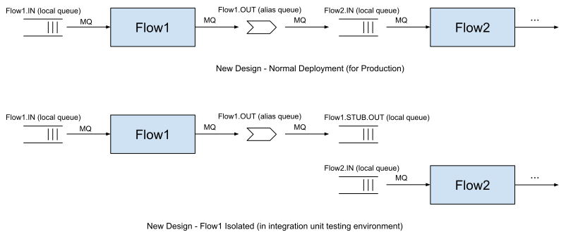
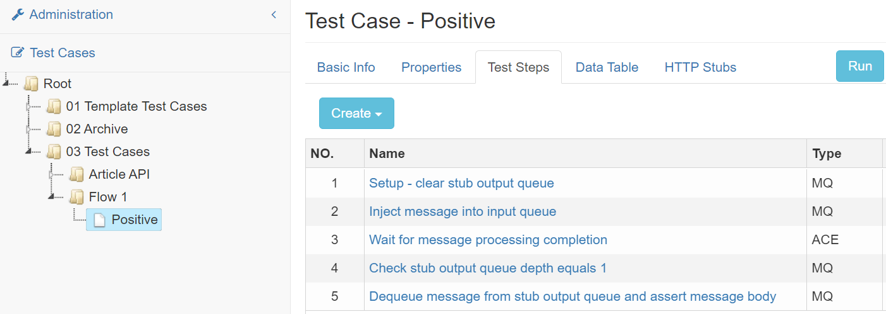

API Test Base enables test driven development (TDD) for IBM ACE message flows, but this page covers the basic method, which assumes the message flow code has already been written before we test it.

## Introduction To The Message Flow Under Test

The message flow under test (Flow1) has an MQ Input node to receive input message, a Compute node to process the message, and an MQ Output node to output the message to an MQ local queue.


The output queue is a 'joint' queue as there is a downstream message flow (Flow2) listening to it, as shown below.


The primary way to integration unit test Flow1 is to provide input to it and examine its output. There is a problem, though: before we get a chance to examine it, the output message produced by Flow1 is immediately picked up by Flow2.

## Test Isolation
A critical thing to do for ACE integration unit testing is to **isolate the message flow under test**. In our scenario, we need to isolate Flow1. There are several approaches to do so.
1. Redesign Flow1 to use an alias queue as its output queue which points to the 'joint' queue (make this a standard in the team so that the next time we won't need to redesign another message flow to test). Before testing Flow1, (manually or automatically) modify the alias queue to point to a stub local queue for Flow1.
2. During Flow1 deployment, use a BAR override to modify the queue name property on the MQ Output node in Flow1 to be a stub local queue.
3. Stop the downstream message flow (Flow2), so that no one (other than the test case) is getting messages from the 'joint' queue.

Approach 1 is recommended as it is simple.



Notice that the isolation is only needed in the integration unit testing environment (developer's local machine or the CI/CD pipeline). Other environments such as ST (System Testing) or SIT (System Integration Testing) environment may not need it as the testing scope or strategy is different.

On the other hand, configuring a message flow or queue differently in different environments is quite common in ACE projects.

## Test Case Creation
Based on the isolation, a positive test case for Flow1 would have these steps.

```
1. (MQ step) Setup - clear stub output queue
2. (MQ step) Inject message into input queue
3. (ACE step) Wait for message processing completion
4. (MQ step) Check stub output queue depth equals 1
5. (MQ step) Dequeue message from stub output queue and assert message body
```

Steps 1, 2, 4 and 5 use the MQ test step's `Clear Queue`, `Enqueue`, `Check Queue Depth` and `Dequeue` actions respectively — see [MQ Request](/docs/en/mq-request) for details of these actions.

Step 3 is to ensure that Flow1 finishes all the work processing the input message, including putting the message to the output queue. Without it, the test case run might fail, as we don't know how much time the Compute node will take to finish the message processing, but step 2 finishes immediately and there might be no message in the stub output queue yet when step 4 runs.

Step 3 is backed by the ACE test step's `Wait For Processing Completion` action, which monitors the message flow's activity log to **timely detect the signal of message processing completion**.

Steps 4 and 5 are where the **side effect** of Flow1, i.e. the message actually put onto a real MQ queue, is verified. Step 4 asserts that exactly one message is in the stub output queue. Step 5 dequeues the message and asserts the message body with an [XMLEqual assertion](/docs/en/assertions#xmlequal-assertion).

The resulting test case looks like below



Not part of the test case, but as a once-off task, make sure the IBM MQ client jar and the ACE IntegrationAPI jar are copied to the ATB lib folder, as described in the [IBM MQ](/docs/en/interact-with-other-systems#ibm-mq) and [IBM ACE](/docs/en/interact-with-other-systems#ibm-ace) sections of Interact with Other Systems.

Run the test case by clicking the `Run` button, and check the test report.

## Sample Test Case
The test case created above is available for download at <a href="../../sample-testcases/ace/queue-to-queue/Positive.json" download>sample test case</a>.

After download, right click anywhere in the left side pane on ATB UI, and select `Import Test Case` to import it.

After import, fill in the endpoint details of the MQ and ACE test steps, so that API Test Base can connect to your queue manager and integration node. Also update the properties defined on the test case (`app.name`, `flow.name`, `input.message`, `expected.output.message`, etc.) to match your message flow.