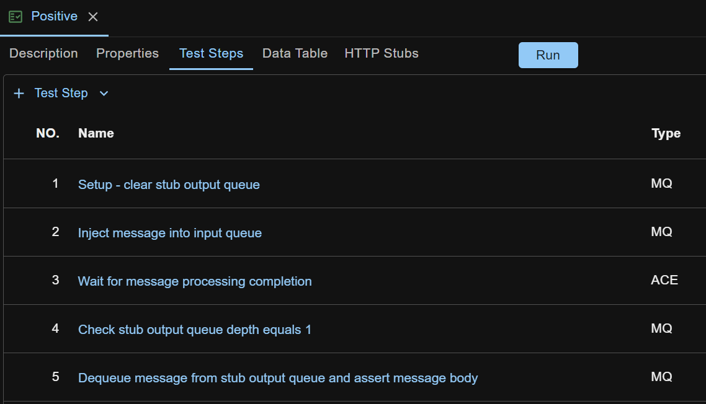

Though API Test Base enables `test driven development (TDD) for IBM ACE message flows`, this page is about basic method which assumes the message flow code has already been written before we test it.

Below is the sample scenario. Check section [Sample Test Case](#sample-test-case) if you are eager to see what the test case looks like.

## Message Flow Introduction

The message flow under test (Flow1) has an MQ Input node to receive input message, a Compute node to process the message, and an MQ Output node to output the message to an MQ local queue. 

The output queue is a 'joint' queue as there is a downstream message flow (Flow2) listening to it, like shown below.

The primary way to integration unit test Flow1 is to provide input to it and examine its output. Now there is a problem. Before we get a chance, the output message produced by Flow1 is immediately picked up by Flow2, i.e. we won't be able to examine Flow1's output message here.

## Message Flow Test Isolation
A critical thing to do for ACE integration unit testing is to `isolate the message flow under test`. In our scenario, we need to isolate Flow1. There are several approaches to do so.
1. Redesign Flow1 to use an alias queue as its output queue which points to the 'joint' queue (make this a standard in the team so that the next time we won't need to redesign another message flow to test). Before testing Flow1, (manually or automatically) modify the alias queue to point to a stub local queue for Flow1.
2. During Flow1 deployment, use baroverride to modify the queue name property on the MQ Output node in Flow1 to be a stub local queue.
3. Stop the downstream message flow (Flow2), so that no one (other than the test case) is getting messages from the 'joint' queue.
4. Other?

Approach 1 is my favorite as it is simple.

Notice that the isolation is only needed in integration unit testing environment. Other environment such as ST (System Testing) or SIT (System Integration Testing) environment may not need it as the testing scope or strategy is different. On the other hand, configuring a message flow or queue differently in different environments is quite common in ACE project.
   
## Test Case Creation
Based on the isolation, a positive test case for Flow1 would have these steps.

    1. Setup - clear stub output queue
    2. Inject message into input queue
    3. Wait for message processing completion
    4. Check stub output queue depth equals 1
    5. Dequeue message from stub output queue and assert message body    

Step 3 is to ensure that Flow1 finishes all the work processing the input message, including putting the message to the output queue. Without it, the test case run might fail, as we don't know how much time the Compute node will take to finish the message processing, but the step 2 finishes immediately and there might be no message in the stub output queue when step 4 runs.

Step 3 is backed by ACE test step 'Wait For Processing Completion' action which monitors message flow's activity log to `timely detect the signal of message processing completion`.

The result test case looks like below

## Sample Test Case
The test case created above is available for download at <a href="../../sample-testcases/ace/queue-to-queue/Positive.json" download>sample test case</a>. After download, right click anywhere in the left side pane on ATB UI, and select `Import Test Case` to import it.

## What is Integration Unit Testing?
Refer to [this post](https://medium.com/@zhengwang666/integration-unit-testing-683fbf995c43){:target="_blank"}.