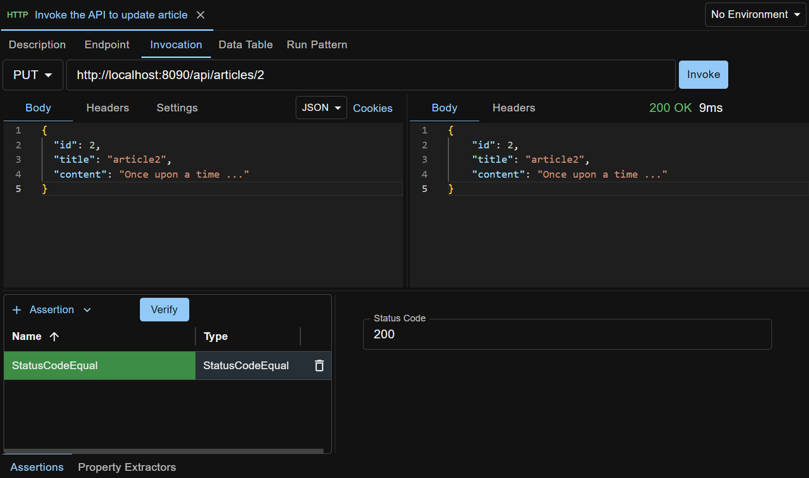

We are going to demo how to test a REST API that updates an article record in database. Check section [Sample Test Case](#sample-test-case) if you are eager to see what the test case looks like.

The REST API is the sample Article API that is bundled with API Test Base. It does CRUD operations on the records in the Article table in a sample H2 database. The sample database is automatically created under `<ATB_DATA_DIR>/database` when API Test Base is launched for the first time. Refer to [Maintenance](/docs/en/maintenance) for more details.

We are planning to have three test steps in our test case
```
1. Set up database data
2. Invoke the API to update article
3. Check database data
```

## Create Test Case Outline
First of all, create a new test case. (You can create your preferred folder structure for managing test cases, by right clicking anywhere in the left side pane and selecting needed context menu item.)

Now we can add test steps to the test case.

Under the Test Steps tab, click `+ Test Step` dropdown button and select `Database`. Enter the name of step 1 `Set up database data`. Repeat this to add the other two test steps (one HTTP step and another Database step). The test case outline is created as shown below.


## Populate Step 1
Click the name of step 1 to open its edit view.

Under the `Endpoint` tab, set JDBC URL `jdbc:h2:<ATB_DATA_DIR>/database/sample;AUTO_SERVER=TRUE`, replacing `<ATB_DATA_DIR>` with the value on your machine (refer to [Maintenance](/docs/en/maintenance)). The JDBC URL will be used by the test step to connect to the sample database.

Then set Username to `user` and Password to `pass`.

Under the `Invocation` tab, enter below SQL script.
```
-- Clear the table
delete from article;

-- Create two article records
insert into article (id, title, content) values (1, 'article1', 'content1');
insert into article (id, title, content) values (2, 'article2', 'content2');
```

Click the `Invoke` button to try it out (i.e. run the script), like shown below.


## Populate Step 2
Open step 2 from the test case.

Under the `Invocation` tab, select `PUT` from the Method dropdown list, and set URL `http://localhost:8090/api/articles/2`.

Select JSON from the Body type dropdown list, and paste the request body:

```
{
  "id": 2,
  "title": "article2",
  "content": "Once upon a time ..."
}
```

Click the `Invoke` button to try it out.


Click the `Assertions` tab at the bottom of the screen to open the assertions panel.

In the assertions panel, click `+ Assertion` dropdown button and select `StatusCodeEqual` to create a StatusCodeEqual assertion. Set the expected HTTP response status code (here 204), and click the `Verify` button to verify the assertion, as shown below.



More information about assertions can be found on this [page](/docs/en/assertions).

## Populate Step 3
Open step 3 from the test case.

Under the `Endpoint` tab, enter exactly the same information as in step 1 because we are interacting with the same database. The information duplication can be avoided by using `managed endpoints`. Refer to this [page](/docs/en/endpoints-management) for more details.

Under the `Invocation` tab, enter SQL query `select id, title, content from article;`.

Click the `Invoke` button to try it out (run the query), like shown below.


Click the `Assertions` tab to open the assertions panel. In the assertions panel, click `+ Assertion` dropdown button and select `JSONEqual` to create a JSONEqual assertion. Copy the JSON string from the test step invocation response to the Expected JSON field, and click the `Verify` button to verify the assertion, as shown below.


## Run the Test Case
Now we have finished editing our test case. It's time to run it. Open the test case, click the `Run` button and you'll see the result, like shown below.


Click a test step in the right side outline to open a modal and see the step's run report, like shown below.


Click the result link beside the Run button to see the whole test case run report. There is a download icon in the report for you to download the report as HTML file, which can then be used as test evidence in other places such as HP ALM.

## Sample Test Case
The test case created above is available for download at <a href="../../sample-testcases/basic-use/Update Article.json" download>sample test case</a>. After download, right click anywhere in the left side pane on ATB UI, and select `Import Test Case` to import it.