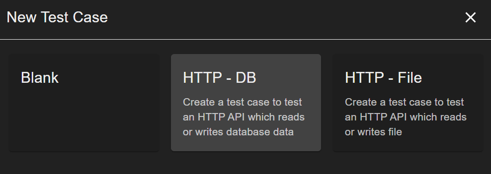
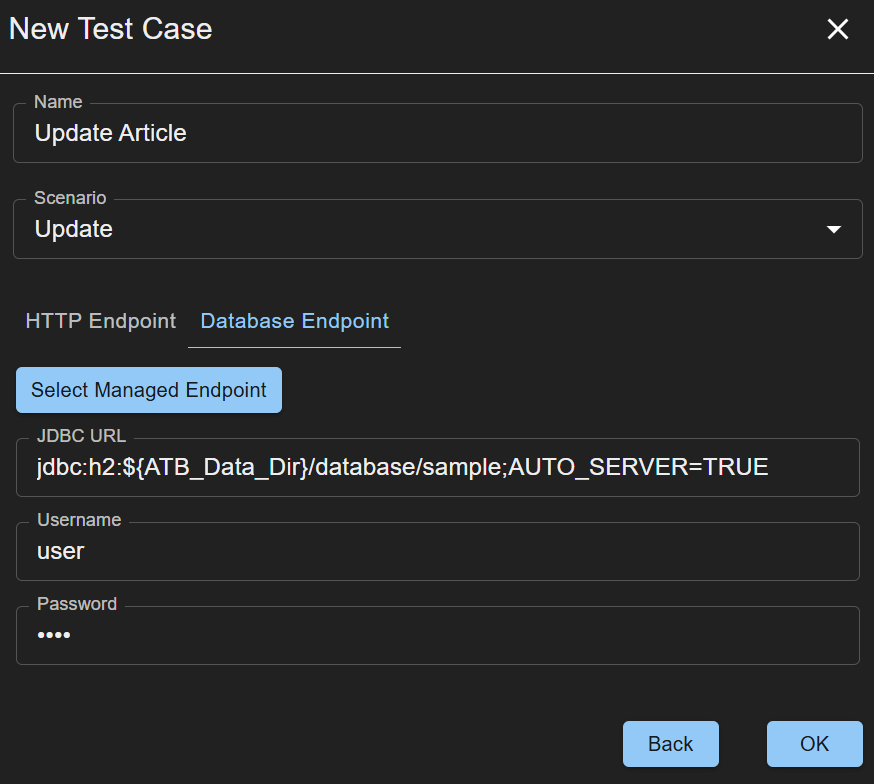
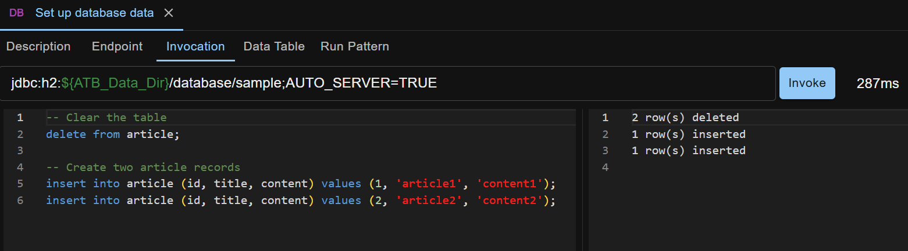
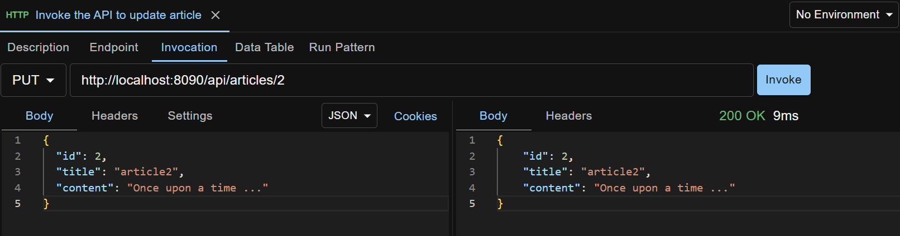
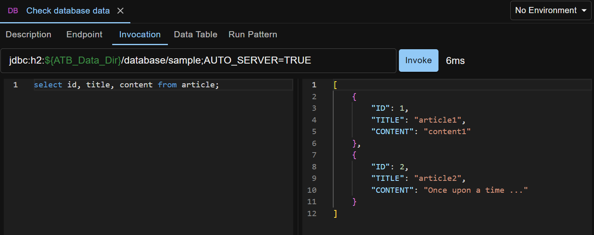
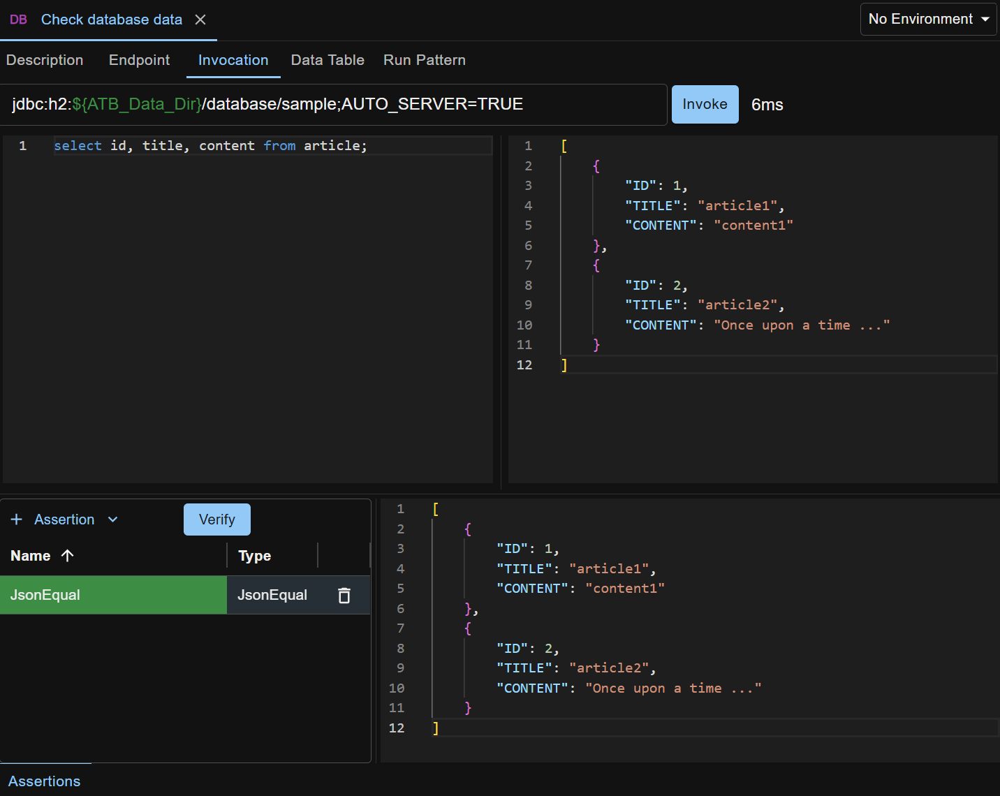
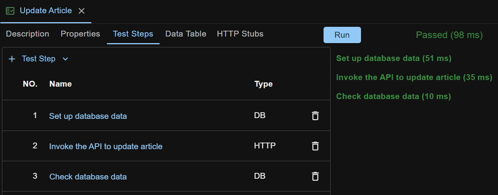

We are going to demo how to test a REST API that updates an article record in database, like shown below.

<div style="text-align: center">
    
</div>

The REST API is the sample Article API that is bundled with API Test Base. It does CRUD operations on the records in the Article table in a `sample` H2 database. The `sample` database is automatically created under `<ATB_DATA_DIR>/database` when API Test Base is launched for the first time. Refer to [Administration](/docs/en/administration) for more details.

We are planning to have three test steps in our test case
```
1. Set up database data
2. Invoke the API to update article
3. Check database data
```

## Create Skeleton Test Case
First of all, create a new test case, by right clicking anywhere in the left side pane and selecting `New Test Case`. A wizard pops up.



Select the `HTTP - DB` pattern, and the pattern details form displays. Populate test case name `Update Article`, scenario `Update`, HTTP Endpoint URL `http://localhost:8090/api/articles/2`, Database Endpoint JDBC URL `jdbc:h2:${ATB_Data_Dir}/database/sample;AUTO_SERVER=TRUE`, Username `user` and Password `pass`.  



Here the scenario `Update` means we are testing a resource-update scenario. HTTP Endpoint is the endpoint of the REST API we are going to test. Database Endpoint is the endpoint of the `sample` H2 database.

For more details about the `${ATB_Data_Dir}` in the Database Endpoint JDBC URL, please refer to [Properties](/docs/en/properties). 

Click `OK` to create the skeleton test case.

Under the `Test Steps` tab, click somewhere in the blank space inside the HTTP step's name cell, and rename the step to `Invoke the API to update article`.

The skeleton test case is as shown below.


## Populate Step 1
Click the name of step 1 to open its edit view.

Under the `Invocation` tab, enter below SQL script.
```
-- Clear the table
delete from article;

-- Create two article records
insert into article (id, title, content) values (1, 'article1', 'content1');
insert into article (id, title, content) values (2, 'article2', 'content2');
```

Click the `Invoke` button to try it out (i.e. run the script), like shown below.



## Populate Step 2
Open step 2 from the test case.

Under the `Invocation` tab, select `JSON` from the Body type dropdown list, and paste the request body:

```
{
  "id": 2,
  "title": "article2",
  "content": "Once upon a time ..."
}
```

Click the `Invoke` button to try it out.



Click the `Assertions` tab at the bottom of the screen to open the assertions panel.

Select the `StatusCodeEqual` assertion and click the `Verify` button to verify the assertion, as shown below.


More information about assertions can be found at [Assertions](/docs/en/assertions).

## Populate Step 3
Open step 3 from the test case.

Under the `Invocation` tab, enter SQL query `select id, title, content from article;`.

Click the `Invoke` button to try it out (run the query), like shown below.



Click the `Assertions` tab to open the assertions panel.

Select the `JSONEqual` assertion, copy the JSON string from the test step invocation response to the `Expected JSON` field, and click the `Verify` button to verify the assertion, as shown below.



## Run the Test Case
Now we have finished editing our test case. It's time to run it. Open the test case, click the `Run` button and you'll see the result, like shown below.



Click a test step in the right side outline to open a modal and see the step's run report, like shown below.


## Sample Test Case
The test case created above is available for download at <a href="../../sample-testcases/basic-use/Update Article.json" download>sample test case</a>. After download, right click anywhere in the left side pane on ATB UI, and select `Import Test Case` to import it.