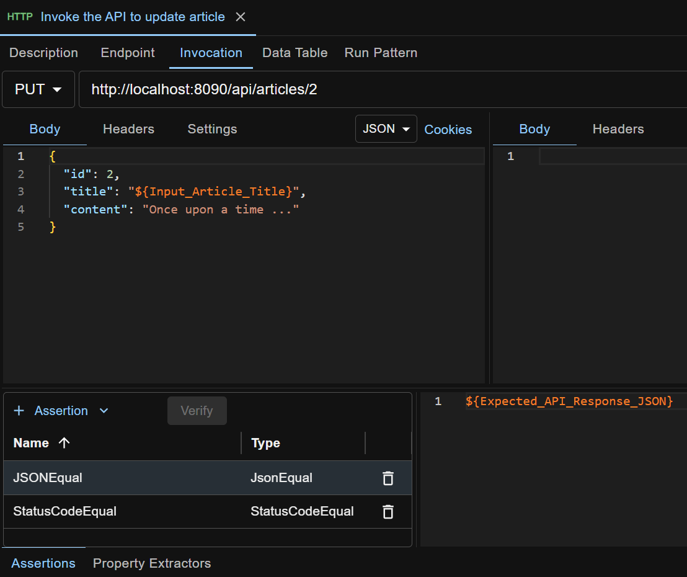

Data driven testing is a popular technique in API testing. It enables you to run the same test case with various test data.

Suppose you have a test case that invokes an API with input data and examines the API's output data. If you want to invoke the same API with different input data and examine corresponding output data, data driven testing can help. Define a data table on the test case, and each row in the table will trigger one individual run of the test case, feeding the run with properties in the row.

This technique saves you the need to create multiple test cases that use different test data but have the same test steps. It greatly reduces the cost of test case creation, run and maintenance when various test data is involved.

## Data Table
Data table in Iron Test can be defined on a test case under the Data Table tab of test case edit view. A sample is shown below.

Each row in the table contains a set of properties to feed each test case individual run. Property name is column name, and property value is cell value.
    
You can define two types of columns in the table: `String column, DB endpoint column`.

String property can be referenced in any test step or assertion, and DB endpoint property can only be referenced in DB test step. Refer to [Properties](https://github.com/zheng-wang/irontest/wiki/Properties) for more details.

A `Caption` column is by default defined in data table. It enables you to mark/label each row in the table, so that the purpose of the row is clear. Caption column will not be used as property when running test case, but it makes test case run report easier to read.

## Sample Scenario
Take the test case from [basic use](https://github.com/zheng-wang/irontest#integrated-json-http-api-testing) as a starting point. We will refactor it to enable testing Article update with two sets of data in one test case. One is for testing successful article update, and the other is for testing an error case when the article title is too long (over 50 chars) to be persisted into the database.

### Refactor the test case to be data driven
What we got from the [basic use](https://github.com/zheng-wang/irontest#integrated-json-http-api-testing) was a test case like below

Firstly, we rename the test case to `Update Article - Data Driven` by right clicking the test case in the tree pane and select Rename.

Then we refactor test steps to use property references for variable test data, and then add data table rows to define the properties.

#### Refactor step 2
On Test Steps tab, open step 2 `Invoke the API to update article`. 

On the Invocation tab, replace the "title" field value in the request body with a property reference ${Input_Article_Title}.

Click the Assertions button to open the assertions area. Replace the Status Code value of the StatusCodeEqual assertion with a property reference ${Expected_API_Response_Status_Code}.

For more thorough testing than only checking API response status code, we add a JSONEqual assertion to check the API response body. Set the Expected JSON with a property reference ${Expected_API_Response_JSON}.

Notice that the properties Input_Article_Title, Expected_API_Response_Status_Code and Expected_API_Response_JSON do not exist yet. We'll create them in data table later.

#### Refactor step 3
Go back to test case edit view, and on Test Steps tab open step 3 `Check database data`.

Replace the Expected JSON of the JSONEqual assertion with a property reference ${Expected_Result_Database_Data}.

#### Add data table columns
We have used property references in our test steps. Now we create the properties in data table.

Go back to the test case edit view, and on the Data Table tab click the Add Column > String Column button to add a new column. Set its name Input_Article_Title. Similarly, add more columns for the other properties.

#### Add data table rows
On the Data Table tab, use the Add Row button to add two rows, and fill the rows with below data

| &nbsp;&nbsp;&nbsp;&nbsp;&nbsp;&nbsp;&nbsp;&nbsp;Caption&nbsp;&nbsp;&nbsp;&nbsp;&nbsp;&nbsp;&nbsp;&nbsp; | Input_Article_Title | Expected_API_Response_Status_Code | &nbsp;&nbsp;&nbsp;&nbsp;&nbsp;&nbsp;Expected_API_Response_JSON&nbsp;&nbsp;&nbsp;&nbsp;&nbsp;&nbsp; | Expected_Result_Database_Data |
| --- | --- | --- | --- | --- |
| Positive | article2 | 200 | { &nbsp;&nbsp;"id": 2, &nbsp;&nbsp;"title": "article2", &nbsp;&nbsp;"content": "Once upon a time ..." } | [{"id":1,"title":"article1","content":"content1"},{"id":2,"title":"article2","content":"Once upon a time ..."}] |
| Negative - article title too long | looooooooooooooo ooooooooooooo oooooooooooong title | 500 | { &nbsp;&nbsp;"code": 500, &nbsp;&nbsp;"message": "#{json-unit.ignore}", &nbsp;&nbsp;"details": "#{json-unit.regex}.\*Value too long for column \\"TITLE[\\\\s\\\\S]\*" } | [{"id":1,"title":"article1","content":"content1"},{"id":2,"title":"article2","content":"content2"}] |

If you don't understand what #{json-unit.ignore} or #{json-unit.regex} means, refer to [JSONEqual Assertion](https://github.com/zheng-wang/irontest/wiki/Assertions#jsonequal-assertion).

In the data table, click a cell to fill short (typically one line) data, or double click a cell to bring up a modal for filling long (typically multi-line) value like below.

The complete data table looks like below.

Now we have finished refactoring the test case. The testing logic is not changed. The only thing changed is that the test case is now data driven.

### Run the test case
Finally, it's time to run the test case. Click the Run button on the test case edit view, and you'll see the result for the whole test case beside the Run button, and in the bottom pane an outline of result for all individual runs. Click an individual run to expand it and view the result of its step runs.

Click a step run link to view its report, or click the result link beside the Run button to see the whole test case run report.