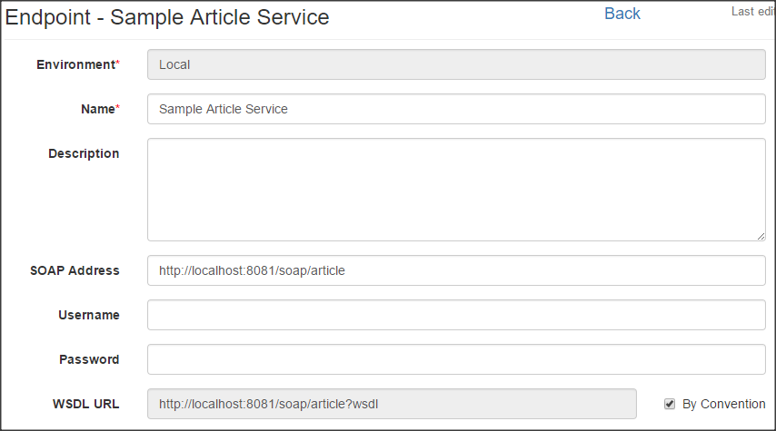
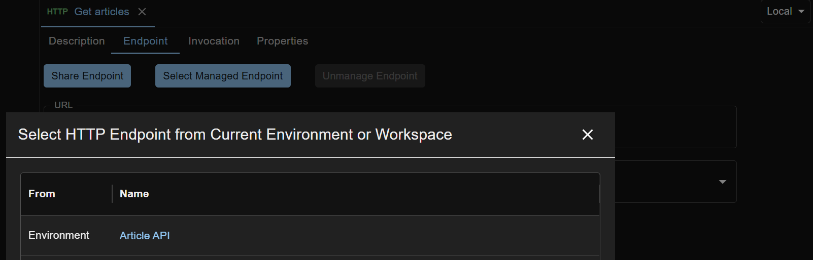
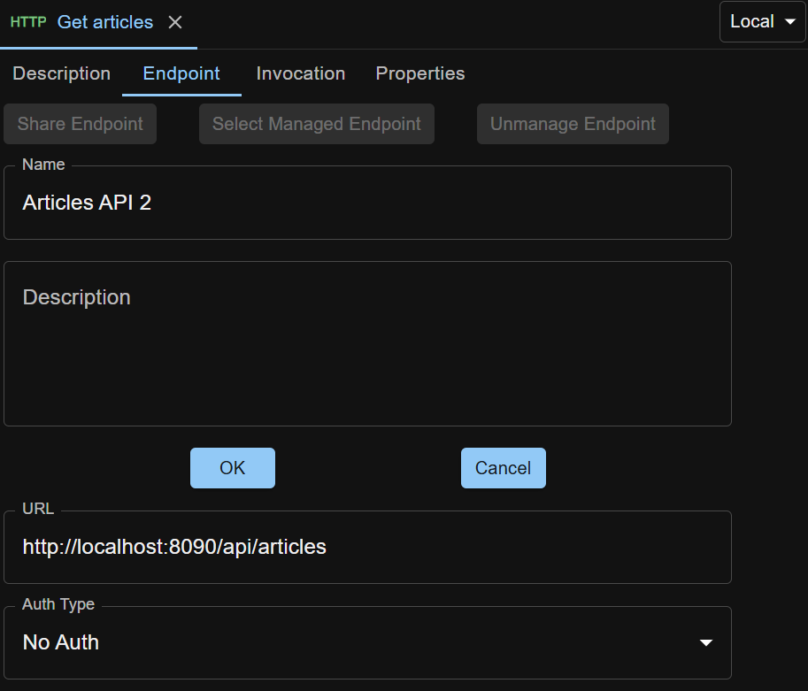

When a new test step is created, and it needs an endpoint, an 'unmanaged' endpoint with empty values will be created and associated with it. Unmanaged endpoint is specific to a test step, and is invisible to other test steps (in the same test case, or in other test cases).

To reuse endpoints across test steps or test cases, you can create `managed endpoints`.

## Create Environment
Managed endpoint resides in environment. If you haven't created an environment, click the Administration > Environments link in the left panel, and click Create button. A new environment is created and its edit view displays.
 
Under the Basic Info tab, enter name and (optional) description. Click Endpoints tab.

There are two ways to create a managed endpoint. Here we use SOAP endpoint as an example.

## Create Managed Endpoint in the Environments area
In the 'Local' environment we just created, click Create dropdown button and select SOAP Endpoint to create a managed SOAP endpoint. SOAP endpoint edit view displays. Enter details and Iron Test saves them automatically.

To use the newly created managed endpoint, go to the SOAP test step by clicking its link in the test case edit view, and click the Endpoint Details tab. Click Select Managed Endpoint button to see a SOAP endpoint list popup. 

Click the endpoint name to select it for use in the SOAP test step.

## Share Unmanaged Endpoint from Test Step
This is a convenient function for you to capture endpoint during test step edit.

Under Endpoint Details tab of a test step with unmanaged endpoint, click Share Endpoint button. Enter details and click OK button. The unmanaged endpoint will be turned into managed.

Notice that while unmanaged endpoint can be edited in test step edit view, managed endpoint can only be edited in the Environments area.

## Changing from Managed Endpoint to Unmanaged for a Test Step
Clicking the Unmanage Endpoint button under the Endpoint Details tab of a test step will allow you to change the already chosen managed endpoint to unmanaged (keeping the managed one untouched).
 