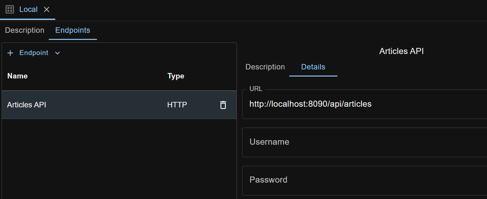

When a new request is created, an `unmanaged endpoint` with empty values will be created and associated with it.

Unmanaged endpoint is specific to a request, and is invisible to other requests.

To reuse endpoints across requests, you can create `managed endpoints` in environments.

Refer to this [page](/docs/en/environments-management) for more information about environments.

There are two ways to create a managed endpoint. Here we use HTTP endpoint as an example.

## Create Managed Endpoint in the Environments area
Suppose you have created an environment (like 'Local') in the Environments area, open the environment. Click `+ Endpoint` dropdown button, select `HTTP`, give it a name (like 'Articles API') and press Enter. A managed HTTP endpoint is created with its edit view displayed on the right.

Input details into the fields, and the endpoint looks like below. 

To use the newly created managed endpoint, first make sure its environment is selected for your workspace.

Go to an HTTP request, click the `Endpoint` tab, and click `Select Managed Endpoint` button to see a modal that lists all HTTP endpoints from the selected environment (here 'Local').

Click the endpoint name to select it for use in the HTTP request.

## Share Unmanaged Endpoint from Request
This is a convenient feature for you to capture endpoint details while editing a request, and then turn the (unmanaged) endpoint into managed.

Under `Endpoint` tab of a request, click `Share Endpoint` button. Enter details and click `OK` button. The (unmanaged) endpoint will be shared into the currently selected environment (here 'Local').

## Changing from Managed Endpoint to Unmanaged for a Request
Clicking the `Unmanage Endpoint` button under the `Endpoint` tab will allow you to clone the managed endpoint to an unmanaged one for the request. The managed one stays untouched in its containing environment.
 