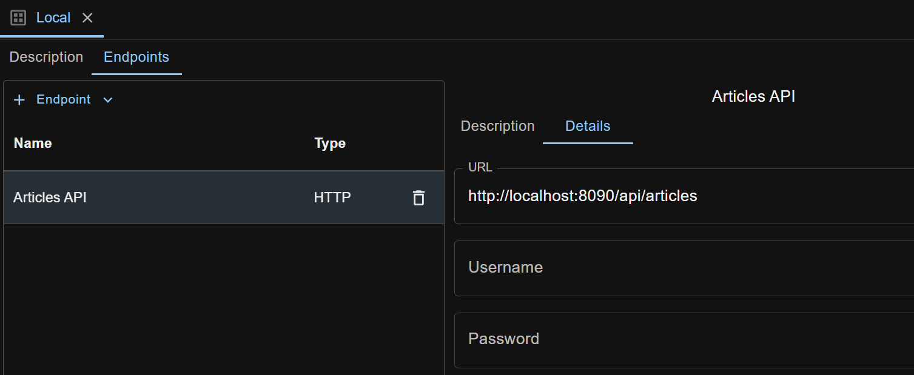
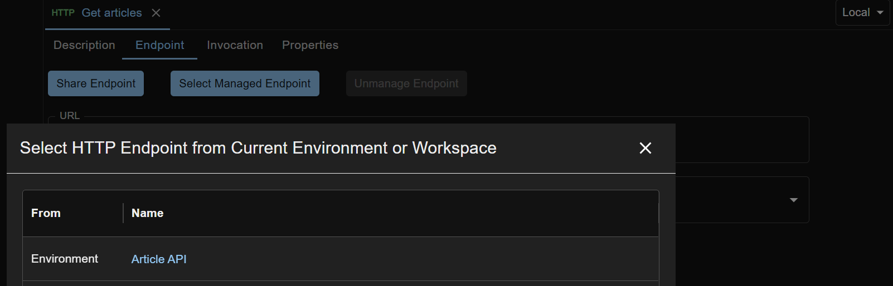
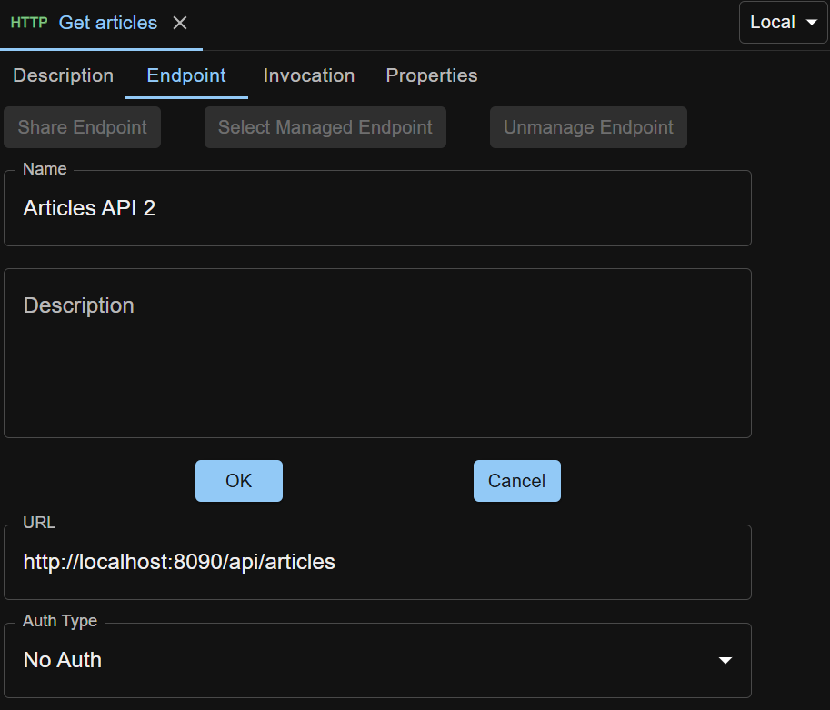

An endpoint holds the connection details — the address, credentials, and any other parameters — for the system a request or test step talks to.

When a new request is created, an `unmanaged endpoint` with empty values will be created and associated with it.

Every request has exactly one endpoint. A test step has at most one: steps that interact with another system — an HTTP step, a database step, and so on — each have one, while steps such as Wait or Docker have none. An endpoint, where present, is either unmanaged or managed. An unmanaged endpoint has all its fields defined inline, so it is specific to that request or test step and invisible to everything else. A test step has no YAML file of its own; its details, including any endpoint, are stored in the containing test case YAML.

To reuse endpoints across requests, you can create `managed endpoints` in [Environments](/docs/en/environments-management) or the workspace. A managed endpoint is referenced by name: only the endpoint name is stored in the request or test case YAML, and the details come from a managed endpoint of that name in the currently selected environment or the workspace. Under the `Endpoint` tab of a request or test step, a managed endpoint's details appear read-only whenever an endpoint of that name exists in the selected environment or workspace, and can be changed only in that environment or workspace; an unmanaged endpoint's details, by contrast, are edited directly on that tab. At run time, a managed endpoint is resolved by name the same way, against the selected environment or workspace.

## Scope
An endpoint defined on an environment is effective only while that environment is selected. An endpoint defined on the workspace is effective across all environments in the workspace. When an environment and the workspace both define an endpoint of the same name, and the environment is selected, the one on the environment takes priority.

## Creating Managed Endpoints

The steps below use an HTTP endpoint as the example; the same applies to other endpoint types. For fields specific to a type, see [JMS Request](/docs/en/jms-request) and [MQ Request](/docs/en/mq-request).

### Create Managed Endpoint in an Environment
Suppose you have created an environment (like `Local`) in the Environments area, open the environment. Click `+ Endpoint` dropdown button, select `HTTP`, give it a name (like 'Article API') and press Enter. A managed HTTP endpoint is created.

Enter details into the fields, and the endpoint looks like below.

To use the newly created managed endpoint, first make sure its environment is selected for your workspace.

Go to an HTTP request, click the `Endpoint` tab, and click `Select Managed Endpoint` button to see a modal that lists all HTTP endpoints from the selected environment (here `Local`) and workspace.

Click the endpoint name to select it for use in the HTTP request.

### Create Managed Endpoint in a Workspace
Open the workspace metadata from the `Workspace Metadata` icon in the left sidebar, and create managed endpoint in it similarly as creating managed endpoint in an environment.

### Share Unmanaged Endpoint from Request
This is a convenient feature for you to capture endpoint details while editing a request, and then turn the unmanaged endpoint into managed.

Under the `Endpoint` tab of a request, click the `Share Endpoint` button. The tab adds `Share Into`, `Name`, and `Description` controls on top of the existing endpoint fields; choose the environment (here `Local`) or the workspace, name the endpoint, and click `OK` to create the managed endpoint.

## Changing from Managed Endpoint to Unmanaged for a Request
Clicking the `Unmanage Endpoint` button under the `Endpoint` tab will allow you to clone the managed endpoint to an unmanaged one for the request. The managed one stays untouched in its containing environment or workspace.