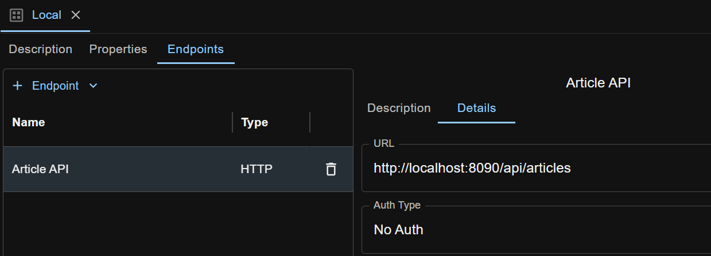
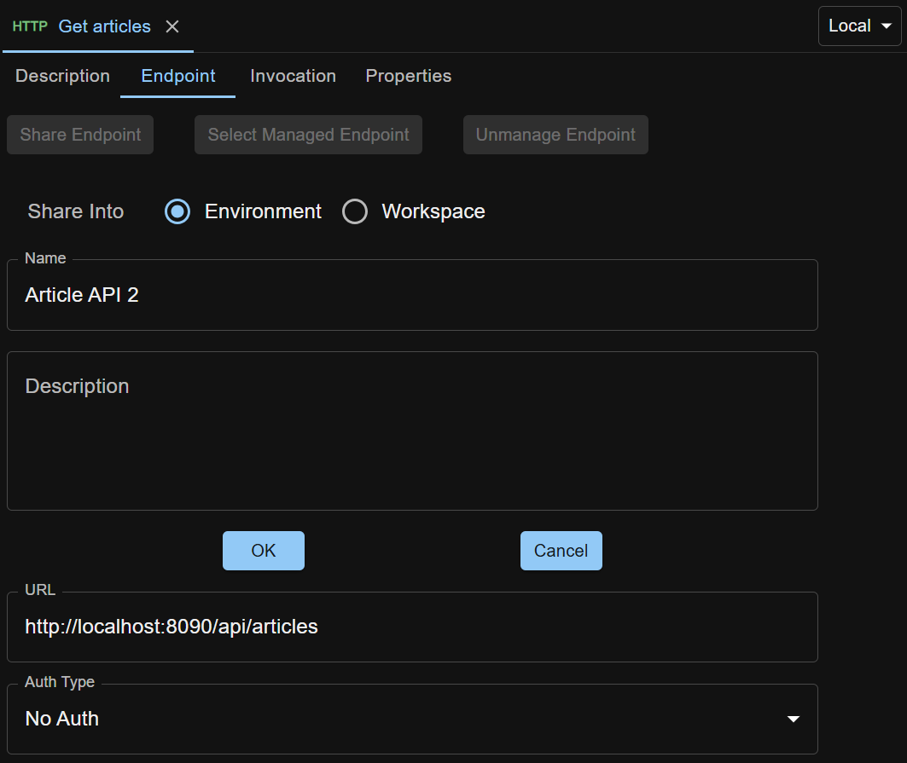

When a new request is created, an `unmanaged endpoint` with empty values will be created and associated with it.

Unmanaged endpoint is specific to a request, and is invisible to other requests.

To reuse endpoints across requests, you can create `managed endpoints` in [Environments](/docs/en/environments-management) or workspace.

## Scope
Endpoint created in an environment is only effective when the environment is selected.

Endpoint created in a workspace is effective across all environments in the workspace.

When an endpoint in an environment and another endpoint in the workspace have the same name, and the environment is selected, the endpoint in the environment takes priority.

## Creating Managed Endpoints

Here we use HTTP endpoint as an example.

### Create Managed Endpoint in an Environment
Suppose you have created an environment (like `Local`) in the Environments area, open the environment. Click `+ Endpoint` dropdown button, select `HTTP`, give it a name (like 'Article API') and press Enter. A managed HTTP endpoint is created.

Enter details into the fields, and the endpoint looks like below. 

To use the newly created managed endpoint, first make sure its environment is selected for your workspace.

Go to an HTTP request, click the `Endpoint` tab, and click `Select Managed Endpoint` button to see a modal that lists all HTTP endpoints from the selected environment (here `Local`) and workspace.

Click the endpoint name to select it for use in the HTTP request.

### Create Managed Endpoint in a Workspace
Open the workspace metadata from the `Workspace Metadata` icon in the left sidebar, and create managed endpoint in it similarly as creating managed endpoint in an environment.

### Share Unmanaged Endpoint from Request
This is a convenient feature for you to capture endpoint details while editing a request, and then turn the unmanaged endpoint into managed.

Under `Endpoint` tab of a request, click `Share Endpoint` button. Enter details and click `OK` button. The unmanaged endpoint will be shared into the currently selected environment (here `Local`) or workspace.

## Changing from Managed Endpoint to Unmanaged for a Request
Clicking the `Unmanage Endpoint` button under the `Endpoint` tab will allow you to clone the managed endpoint to an unmanaged one for the request. The managed one stays untouched in its containing environment or workspace.
 