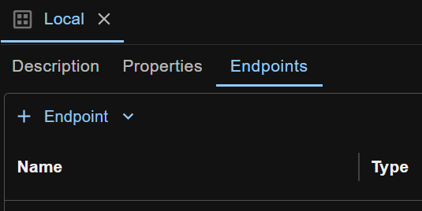

Environments are where common properties and endpoints are managed. You can select an environment for your workspace, so that properties and managed endpoints from that environment can be used when running requests or test cases.

## Create an Environment
To create an environment, click the `Environments` icon in the left side bar of the screen, right click the blank space in the left side pane and select `New Environment` from the context menu.

Give it a name (like 'Local'), press Enter, and a new empty environment is created.

## Select an Environment for Your Workspace
To select an environment for your workspace, just select an item from the dropdown list in the top right corner of the screen.
