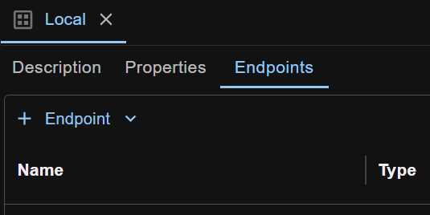
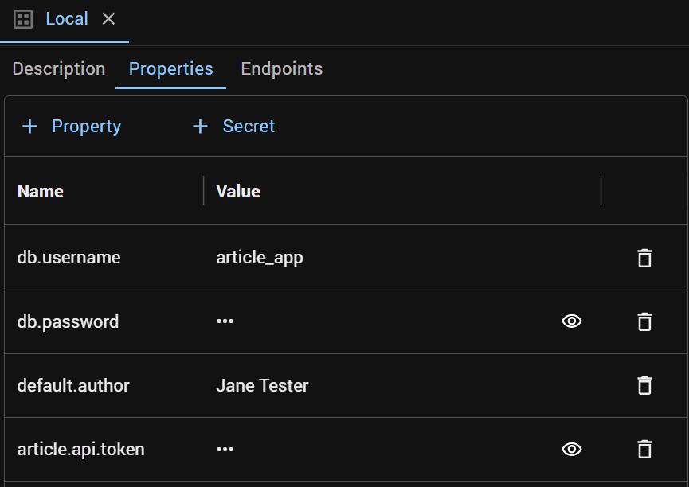

Environments are where common properties, secrets and endpoints are managed. You can select an environment for your workspace, so that the properties, secrets and managed endpoints from that environment are used when running requests or test cases.

A common setup is one environment per place your tests run — for example a private `Local` environment on each developer's machine and a shared `CICD` environment for the pipeline. Selecting an environment repoints every request and test case at that environment's values and endpoints, without editing the requests themselves.

## Create an Environment
To create an environment, click the `Environments` icon in the left sidebar of the screen, right click the blank space in the left side pane and select `New Environment` from the context menu.

Give it a name (like 'Local'), press Enter, and a new empty environment is created.

## Select an Environment for Your Workspace
To select an environment for your workspace, just select an item from the dropdown list in the top right corner of the screen.

## Properties and Secrets
Open an environment and go to the `Properties` tab to define values that requests, test cases, test steps, assertions and HTTP stubs can reuse through `${<Property_Name>}` references. Refer to [Properties](/docs/en/properties) for more on property references.

Click `+ Property` to add a normal property, or `+ Secret` to add a secret. Both have a name and a value, and both are referenced the same way (for example `${db.password}`); the difference is only in how the value is stored and shown.

A normal property's value is stored as plain text in the environment's YAML file, so it travels with the workspace when the workspace is shared through version control (see [Team Collaboration](/docs/en/team-collaboration)).

A secret's value is never written to the environment YAML. The YAML holds only a reference id (a random string); the encrypted value lives in a `secrets.properties` file under the `fileplace` folder of ATB's default data directory (see [Administration](/docs/en/administration) for where that is). That location is fixed — it stays at the default even when `ATB_DATA_DIR` is changed — and the file is local to the machine, never part of the workspace repo. In the table a secret's value is masked, with an eye icon to reveal it. Use a secret for anything sensitive, such as a database password or an API token, so the value never reaches the shared repo.

The secrets defined here are named secrets — they have a name and are referenced like a property. Unnamed secrets also exist: a secret defined on a request or test step's `Endpoint` tab, or in a managed endpoint, has no name, but is stored the same way — the YAML file holds only a reference id that resolves to the encrypted value in the local `secrets.properties` file.

Named secrets can be defined only on an environment. When tests run in a CI/CD pipeline — where no local `secrets.properties` exists — secret values are supplied to the runner at run time instead of being committed; see [Integration Unit Testing Automation in CI/CD Pipeline](/docs/en/integration-unit-testing-automation-in-cicd-pipeline) for how.

## Endpoints
An environment is also where you manage reusable connection endpoints, on the environment's `Endpoints` tab. Refer to [Endpoints Management](/docs/en/endpoints-management) for creating managed endpoints in an environment or workspace and selecting them in a request.

## Scope: Environment and Workspace
Properties and managed endpoints can be defined either on an environment or on the workspace itself (open the workspace from the `Workspace Metadata` icon in the left sidebar). Named secrets, as noted above, are environment-only.

A value defined on an environment is effective only while that environment is selected. A value defined on the workspace is effective across all environments in the workspace. When an environment and the workspace both define an item with the same name, and the environment is selected, the one on the environment takes priority.

This lets you keep values that are identical everywhere on the workspace, and override only the ones that differ per environment.