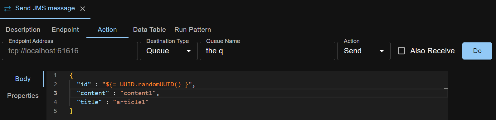

ATB supports Groovy expressions for generating dynamic values at run time — a fresh UUID, a timestamp, a random string, or the result of a calculation. The syntax is `${= the expression }`, where the leading `=` is what sets an expression apart from a property reference (`${ ... }`). Examples:
```
${= UUID.randomUUID() }

${= RandomStringUtils.randomAlphanumeric(10) }

${= ThreadLocalRandom.current().nextInt(0, 100) }

${= new SimpleDateFormat("yyyy-MM-dd'T'HH:mm:ss.SSS").format(new Date()) }

${= (5 + 2) * 8 / 2 % 5 + 0.5 }
```

You can embed a Groovy expression directly in a request, or inside a [property](/docs/en/properties)'s value. For example:



When the request or test case runs, each expression is evaluated and its result is substituted in place as text.

## Default Imports

The following packages and classes are imported by default whenever a Groovy expression is evaluated, so you can use their shorthand names instead of fully qualified names.

```
java.lang.*
java.util.*
java.io.*
java.net.*
groovy.lang.*
groovy.util.*
java.math.BigInteger
java.math.BigDecimal
org.apache.commons.lang3.RandomStringUtils
java.util.concurrent.ThreadLocalRandom
java.text.SimpleDateFormat
```