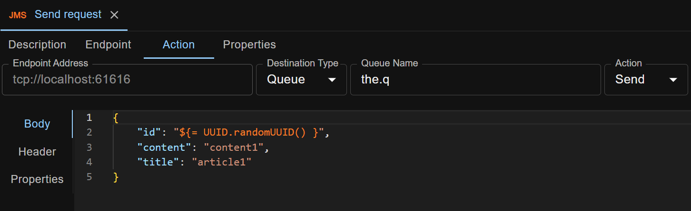

ATB supports Groovy expressions in test cases. The syntax is `${= the expression }`. Examples:
```
${= UUID.randomUUID() }
${= RandomStringUtils.randomAlphanumeric(10) }
${= ThreadLocalRandom.current().nextInt(0, 100) }
${= new SimpleDateFormat("yyyy-MM-dd'T'HH:mm:ss.SSS").format(new Date()) }
${= (5 + 2) * 8 / 2 % 5 + 0.5 }
```

You can embed groovy expressions inside [Properties](/docs/en/properties), or directly inside test step. Following is an example:



When running the test step or test case, the expressions are evaluated and replaced by the evaluation results.

### Default Imports

Following Java classes are by default imported when every Groovy expression is evaluated, so you can use their shorthand names instead of fully qualified names in the expressions.

```
java.lang.*
java.util.*
java.io.*
java.net.*
groovy.lang.*
groovy.util.*
java.math.BigInteger
java.math.BigDecimal
org.apache.commons.lang3.RandomStringUtils
java.util.concurrent.ThreadLocalRandom
java.text.SimpleDateFormat
```
