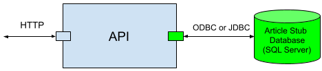
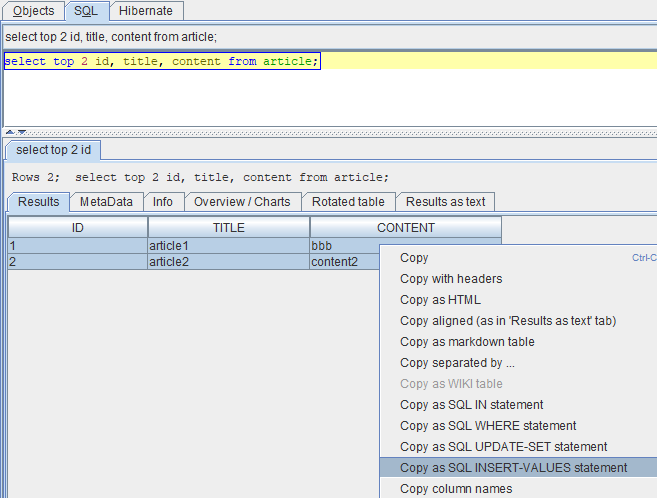

## Introduction To The API Under Test
Suppose you have an Article API that exposes an HTTP endpoint. When a client invokes it with details via HTTP PUT, it updates an article record in a SQL Server database table using a SQL statement like `update dbo.article set title = :title, content = :content where id = :id`.


Check section [Sample Test Case](#sample-test-case) if you are eager to see what the test case looks like.

The example uses SQL Server database, but in the real world it can be any brand of database. The way of doing test isolation, database test data preparation and test case creation is similar, with some differences in detailed techniques.

## Test Isolation
### Use Stub Database Endpoint
To integration unit test the Article API, design the API to point to different dependencies in different environments. This is normally achieved by setting different dependency endpoint addresses in different property files. Each property file contains all properties for the API for a specific environment like Dev/Test/QA/Prod. When deploying and running the API, dynamically load the property file for that specific environment.

In an integration unit testing environment like the Dev environment (which is typically a developer's local machine), a property file like `article-api-dev.properties` is used for the Article API. The property file contains something like below
~~~
    database.host=localhost
    database.port=1433
    database.name=Article
    database.username=<encrypted username>
    database.password=<encrypted password>
~~~ 
Here the database properties are of a local SQL Server Express (stub) database that is used for integration unit testing purpose. We use a local dedicated stub database, instead of any fully implemented and shared SQL Server database like one in the SIT environment, as the dependency during integration unit testing, like shown below.



### Create Stub Table
The Article API will write into the dbo.Article table, so we need to create the table in the stub database, as part of test isolation work. Effectively, we need a SQL script that creates the table. Based on different conditions, the SQL script can be obtained or drafted in ways like
* If the script can be provided by the database administrator, then tailor it to suit your testing purpose.
* Else if the table is already created in a shared database, like the one in SIT environment, use a query like below to get the table structure. Then manually create the SQL script based on the structure.
```
    SELECT c.name as column_name, t.name as column_type, c.max_length, c.precision, c.scale, c.is_nullable
    FROM sys.columns c left outer join sys.types t on c.user_type_id = t.user_type_id
    WHERE object_id = object_id('dbo.Article');
```
* Else if the table is only defined in a design document, manually create the SQL script based on the document content.

Below is a sample SQL script
```
    IF DB_ID('Article') IS NULL
        CREATE DATABASE Article;
        
    USE [Article];
    
    IF OBJECT_ID('dbo.Article', 'U') IS NOT NULL
        DROP TABLE dbo.Article;
        
    CREATE TABLE [dbo].[Article] (
        ID INT,
        Title VARCHAR(50),
        Content VARCHAR(5000)
    );
```

Once the SQL script is obtained or drafted, run it in the stub database, to create the stub table.

Capture the SQL script somewhere, like in the description of the ATB folder that contains the integration unit test cases for the API, in case you need to reuse it later.

## Database Test Data Preparation
We have created the stub table, but it is empty. Each test case will need to populate the table with corresponding test data. Effectively, we need some SQL `INSERT` statements for this purpose. Based on different conditions, the `INSERT` statements can be obtained or drafted in ways like
* If the statements can be provided by the database administrator, then tailor them to suit your testing purpose.
* Else if there are already some rows in a shared database, like the one in SIT environment, use Squirrel SQL Client to export the rows as `INSERT` statements. To achieve this, just run a `SELECT` query in Squirrel SQL Client to show some rows, manually select the rows from the result set table, right click the rows and choose `Select entire row(s)`, right click the rows again and choose `Copy as SQL INSERT-VALUES statement`, and then paste the `INSERT` statements to a text editor.

  
* Else if sample data is only available in a design document, manually create the `INSERT` statements based on the document content.

Once a couple of `INSERT` statements are prepared, they can be tailored and used for different test cases of the API.

## Test Case Creation
Refer to [Creating Automated Test Case](/docs/en/creating-automated-test-case). On that page, the database is an H2 database, but the same steps for test case creation and run can be similarly applied here. Just remember to use your own local Article API endpoint (instead of the ATB bundled one) and your SQL Server stub database endpoint (instead of the H2 one) in the test case.

## Sample Test Case
The test case created above is available for download at <a href="../../sample-testcases/http-db/Positive.json" download>sample test case</a>. After download, right click anywhere in the left side pane on ATB UI, and select `Import Test Case` to import it.

## What is Integration Unit Testing?
Refer to [this post](https://medium.com/@zhengwang666/integration-unit-testing-683fbf995c43){:target="_blank"}.