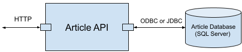
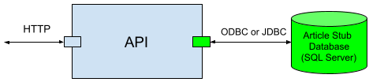

## Introduction To The API Under Test
Suppose you want to test an Article API that exposes an HTTP endpoint. When a client invokes it with details via HTTP PUT, it updates an article record in a SQL Server database table.



## Test Isolation
To integration unit test the Article API, you would typically set up and use a local database. This has some benefits

* The test includes testing the side effect of the Article API. That is, the API interacts with a real database, and actually results in the database data being changed.
* The test is fully controlled by you on your local machine, without impacting any other developer.



### Set up the Stub Database Instance
The simplest way of spinning up a local SQL Server instance is probably launching a Docker container.

This can be done through ATB's Docker test step.

### Create the Stub Database and Table
The Article API will write into the dbo.Article table in the Article database. We need a DDL script that creates the database and the table.

Some common ways to obtain or draft the DDL script are
* (Most likely case) If the table is already created in a shared database, like the one in SIT environment, use a database client (like DBeaver) to connect to the database and get the table DDL.
* Get the script from the database administrator.
* If the table is only defined in a design document, manually create the script based on the document content.

Tailor the script, like by removing unneeded table columns, to suit your testing need.

Below is a sample DDL script
```
IF DB_ID('Article') IS NULL
    CREATE DATABASE Article;

IF OBJECT_ID('Article.dbo.Article', 'U') IS NOT NULL
    DROP TABLE Article.dbo.Article;

CREATE TABLE [Article].[dbo].[Article] (
    ID INT,
    Title VARCHAR(50),
    Content VARCHAR(5000)
);
```

The script can be run through ATB's Database test steps. Notice that the `CREATE DATABASE` statement needs to be run in its own test step, separate from the table creation statements, because the new database only becomes effective after the transaction it is created in is committed. Running the whole script in one test step would fail, with the table creation statements not able to find the database.

### Use the Stub Database Endpoint
Design the Article API to point to different dependencies in different environments. This is normally achieved by setting different dependency endpoint addresses in different property files. Each property file contains all properties for the API for a specific environment like Dev/Test/QA/Prod.

When deploying and running the API, dynamically load the property file for that specific environment.

Here is a sample property file `article-api-dev.properties` for a developer's local machine.
~~~
database.host=localhost
database.port=1433
database.name=Article
database.username=<encrypted username>
database.password=<encrypted password>
~~~

## Database Test Data Preparation
We have created the stub table, but it is empty. Each test case will need to populate the table with corresponding test data. Effectively, we need some SQL `INSERT` statements for this purpose.

Some common ways to obtain or draft the `INSERT` statements are
* If there are already some rows in a shared database, like the one in SIT environment, use a database client (like DBeaver) to export or generate `INSERT` statements out of the rows. Tailor them, like by removing unneeded columns, to suit your testing need.
* Given we already got the DDL, it shouldn't be hard to manually craft the `INSERT` statements.
* Use a database client (like DBeaver) to manually run the DDL script to create the table in the local stub database, insert some dummy rows, and export or generate the `INSERT` statements.

Below is the test data script used in this example. It clears the table first, so that every run starts from a known state.
```
-- Clear the table
delete from article;

-- Create two article records
insert into article (id, title, content) values (1, 'article1', 'content1');
insert into article (id, title, content) values (2, 'article2', 'content2');
```

The script can be run through ATB's Database test step.

## Test Case Creation
Create a test case `Positive` under a folder for the Article API, with below test steps

```
1. (Docker step) Setup - Spin up SQL Server Docker container
2. (DB step) Setup - Wait for SQL Server to start
3. (DB step) Setup - Create stub database
4. (DB step) Setup - Create stub table
5. (DB step) Set up database data
6. (HTTP step) Invoke the API to update article
7. (DB step) Check database data
```

Step 2 runs a trivial query (`select 1;`) with the test step's run pattern set to `Repeat Until Pass` and a timeout, so the step keeps retrying until SQL Server is ready to accept connections.

Step 6 invokes the Article API to update article 2, and asserts that the API returns status code 200. Step 7 is where the side effect of the Article API, i.e. the actual database data change, is verified: it selects all rows from the stub table, and asserts the query result with a [JSONEqual assertion](/docs/en/assertions#jsonequal-assertion). The expected JSON covers both rows, verifying that article 2 is updated and article 1 is left untouched.

Not part of the test case, but as a once-off task, make sure SQL Server JDBC libraries are copied to ATB lib folder, as described [here](/docs/en/interact-with-other-systems#sql-server).

Run the test case by clicking the `Run` button, and check the test report.

## Sample Test Case
The test case created above is available for download at <a href="../../sample-testcases/http-db/Positive.json" download>sample test case</a>.

After download, right click anywhere in the left side pane on ATB UI, and select `Import Test Case` to import it.

Notice that step 6's endpoint URL is a placeholder. Update it to point to an Article API implementation running on your local machine.

## Further Note
Here we are setting up the stub database and table in the test case, for making the example simple. In real work, we don't want to duplicate the test setup steps here and there in many test cases. Instead, we want to manage test setup in a structured manner. Refer to [Structured Test Setup for Integration Unit Test Isolation](/docs/en/structured-test-setup-for-integration-unit-test-isolation) for more details.