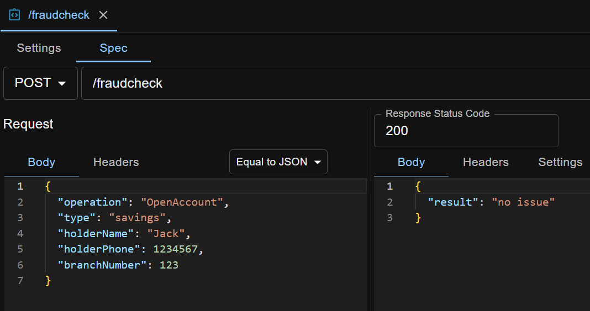
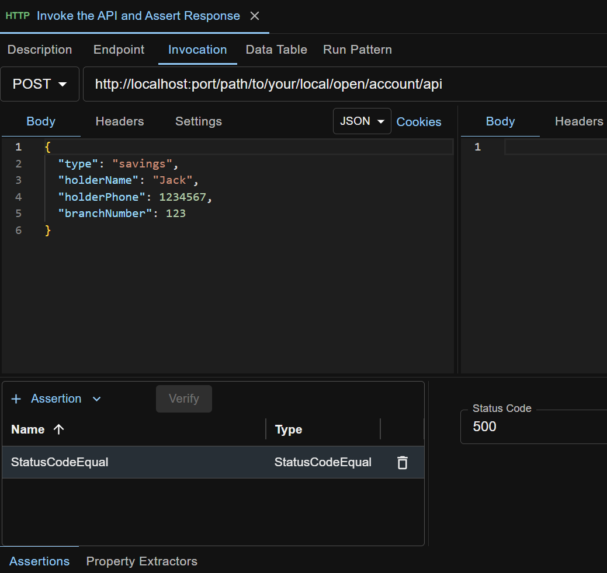

## Introduction To The API Under Test
Suppose you have an Open (Bank) Account API that exposes an HTTP endpoint. When a client invokes it with details, it invokes another HTTP API (Fraud Check). When the Fraud Check API returns 'ok', the Open Account API will invoke yet another HTTP API (Account) which will actually create the account in the database. When the Account API successfully creates the account in database and returns 'ok', the Open Account API will return 'ok' to the client. Below is an illustration.

## Test Isolation
To integration unit test the Open Account API, design the API to point to different dependencies in different environments. This is normally achieved by setting different dependency endpoint addresses in different property files. Each property file contains all properties for the API for a specific environment like Dev/Test/QA/Prod. When deploying and running the API, dynamically load the property file for that specific environment.

In an integration unit testing environment like the Dev environment (which is typically a developer's local machine), a property file like `open-account-api-dev.properties` is used for the Open Account API. The property file contains something like below
~~~
    fraud.check.api.url=http://localhost:8090/fraudcheck
    account.api.url=http://localhost:8090/account
~~~ 
Here the urls are the HTTP stubs' addresses. We use HTTP stubs, instead of any real (fully implemented) Fraud Check and Account APIs, as the dependencies during integration unit testing, like shown below.

## Test Cases Creation
It is recommended that you have a look at [Quick Start](/docs/en/quick-start) if ATB is new to you.

Check section [Sample Test Cases](#sample-test-cases) if you are eager to see what the test cases look like.

### Positive Test
Create a test case `Positive` under a folder for Open Account API test cases. Create an HTTP test step `Invoke the API and Assert Response` in the test case. This test step invokes the Open Account API and asserts that the API returns status code 200.

Under the HTTP Stubs tab, create the HTTP stubs so that a 'successful' open-account operation is done by the Open Account API. For how to create an HTTP stub in ATB, refer to [HTTP Stubs](/docs/en/http-stubs).

For the Fraud Check API stub, if the request body is a JSON string that is equal to the specified JSON string, the stub will return HTTP 200 with the specified body. The Account API stub works similarly.

Run the test case by clicking the `Run` button, and check the test report.

### Negative Test
You can also create negative test case(s) with corresponding http stub(s), to test that the Open Account API fails under some circumstances. For example: when the Fraud Check API (stub) returns status code 500, the Open Account API also returns 500. The test step looks like below:

In this example, only one HTTP stub is needed, i.e. the Fraud Check API stub, because when the Fraud Check API returns 500, the Open Account API will stop processing further, and will return 500 to client immediately. The Account API won't be called at all.

Run the test case by clicking the `Run` button, and check the test report.

## Sample Test Cases
The test cases created above are available for download at <a href="../../sample-testcases/http-http/Positive.json" download>Positive test case</a> and <a href="../../sample-testcases/http-http/Negative.json" download>Negative test case</a>. After download, right click any folder on ATB UI and import.
