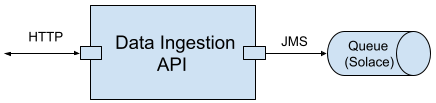
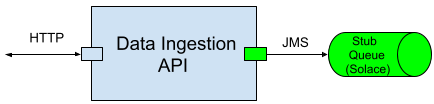

## Introduction To The API Under Test
Suppose you have a Data Ingestion API that exposes an HTTP endpoint. When a client invokes it with data, it delivers the data, unchanged, to a JMS (Solace) queue.



## Test Isolation
To integration unit test the Data Ingestion API, you would typically set up and use a local Solace instance. This has some benefits

* The test includes testing the side effect of the Data Ingestion API. That is, the API interacts with a real Solace queue, and actually results in the message being persisted in the queue.
* The test is fully controlled by you on your local machine, without impacting any other developer.



### Set up the Stub Solace Instance
The simplest way of spinning up a local Solace instance is probably launching a Docker container from the `solace/solace-pubsub-standard` image.

This can be done through ATB's Docker test step.

### Create the Stub Queue
To create the stub queue, we can call the Solace SEMP v2 API from ATB's HTTP test step.

### Use the Stub Queue
Design the Data Ingestion API to point to different dependencies in different environments. This is normally achieved by setting different dependency endpoint addresses in different property files. Each property file contains all properties for the API for a specific environment like Dev/Test/QA/Prod.

When deploying and running the API, dynamically load the property file for that specific environment.

Here is a sample property file `data-ingestion-api-dev.properties` for a developer's local machine.
~~~
solace.host=localhost:55555
solace.vpn=default
solace.queue.name=q/data/ingestion/api/stub/out
~~~

## Test Case Creation
Create a test case `Positive` under a folder for the Data Ingestion API, with below test steps

```
1. (Docker step) Setup - Start solace-auto
2. (HTTP step) Setup - Ensure Solace is ready
3. (HTTP step) Setup - Delete stub output queue
4. (HTTP step) Setup - Create stub output queue
5. (HTTP step) Invoke the API to ingest data
6. (JMS step) Check stub output queue depth equals 1
7. (JMS step) Browse the stub output queue and assert message body
```

Step 2 calls Solace's health-check endpoint, with the test step's run pattern set to `Repeat Until Pass` and a timeout, so the step keeps retrying until Solace is ready.

Steps 3 and 4 delete and recreate the stub queue, so that every run starts from a known state.

Step 5 invokes the Data Ingestion API to ingest data, and asserts that the API returns status code 200. Steps 6 and 7 are where the **side effect** of the Data Ingestion API, i.e. the actual message delivery to the Solace queue, is verified. Step 6 asserts that exactly one message is in the queue. Its run pattern is set to `Repeat Until Pass` with a timeout, to tolerate an asynchronous style of the API's implementation, i.e. the API may return before the JMS message delivery is completed. Step 7 browses the queue, which reads the message without consuming it, and asserts the message body with a [JSONEqual assertion](/docs/en/assertions#jsonequal-assertion), verifying that the data is delivered unchanged.

Not part of the test case, but as a once-off task, make sure the Solace jars are copied to ATB lib folder, as described [here](/docs/en/interact-with-other-systems#solace).

Run the test case by clicking the `Run` button, and check the test report.

## Sample Test Case
The test case created above is available for download at <a href="../../sample-testcases/http-jms/Positive.json" download>sample test case</a>.

After download, right click anywhere in the left side pane on ATB UI, and select `Import Test Case` to import it.

Notice that step 5's endpoint URL is a placeholder. Update it to point to a Data Ingestion API implementation running on your local machine.

The test case also references a property `solace.semp.url` (e.g. `http://localhost:8080/SEMP/v2/config/msgVpns/default`) and a named secret `solace.password` (`admin` for the stub Solace instance). Define both on the environment before running the test case.

## Further Note
Here we are setting up the stub Solace and queue in the test case, for making the example simple. In real work, we don't want to duplicate the test setup steps here and there in many test cases. Instead, we want to manage test setup in a structured manner. Refer to [Structured Test Setup for Integration Unit Test Isolation](/docs/en/structured-test-setup-for-integration-unit-test-isolation) for more details.