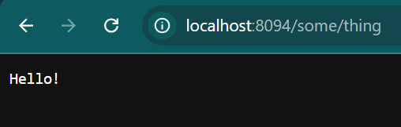

When your API under test has a dependency on an external HTTP API, and you want to test your API in isolation, HTTP stub can help. Repoint the dependency to an HTTP stub, and test your API with it.

There might be reasons for testing your API in isolation
- You want to control the response of the dependency, but you have no control over the external HTTP API.
- The external HTTP API is unavailable or unstable when you test your API.

The same technique is also called mock service or service virtualization in the testing space.

The HTTP Stubs feature in API Test Base is powered by [WireMock](http://wiremock.org/).

## A Quick Play
Let's play with an HTTP stub quickly.

### Create a Stub
Open the Mock Servers view, select the `Manual` mock server, and select its HTTP Stubs tab.

Click `+ Stub` button. On the stub edit view, enter URL `/some/thing` and response body `Hello!`.

The meaning of the stub is that when an HTTP GET request is sent to the `Manual` mock server with URL `http://<ApiTestBaseHost>:<MockServerHttpPort>/some/thing` (like http://localhost:8094/some/thing), the mock server will return an HTTP response with status code `200` and response body `Hello!`.

The default port number of the `Manual` mock server is `8094`, and it can be changed under the `Settings` tab of the mock server.

### Test the Stub
Open a new tab in your browser, and go to `http://localhost:8094/some/thing`, and you'll see response body `Hello!` on the page.

## Mock Server Status
To know what stubs have been loaded into the mock server, or check stub request log, open the mock server Status tab.

## Mock Servers
There are two mock servers in API Test Base: `Manual`, `Auto`.

### The Manual Mock Server
The `Manual` mock server is used for defining and hosting ad hoc HTTP stubs. You can define HTTP stubs on the `Manual` mock server, and then immediately use/invoke it without any dependency.

### The Auto Mock Server
The `Auto` mock server is used when running test cases which have HTTP stubs defined on them. The HTTP stubs are defined on test cases, rather than on mock server.

When a test case runs, the `Auto` mock server is cleared and all HTTP stubs defined on the test case are automatically loaded into the `Auto` mock server, ready to be invoked (by your API under test).

More details follow.

## Use HTTP Stubs in Automated API Testing
It is easy. Create stubs in your test case under its `HTTP Stubs` tab. Every time you run the test case, below things happen automatically
- On test case run start, the `Auto` mock server is reset and all the stubs defined on the test case are automatically loaded into the mock server, ready to be invoked (by your API under test).
    - Mock server reset means all stubs, stub request logs, scenarios, etc. are cleared from the mock server.
- On test case run end, stub requests received by the mock server are checked by asserting
    - All stubs from the test case have been hit.
    - If the 'Check Hit Order' option is selected under the HTTP Stubs tab on the test case edit view, the stubs from the test case have been hit in ascending order by stub number.
    - All stub requests received by the `Auto` mock server have been matched (i.e. each request has hit a stub from the test case).

## Other supported features
- **Setting a delay for response**
- [Response templating](http://wiremock.org/docs/response-templating/)  
    Use attributes of the request in the response.
- [Regex matching on path and query](http://wiremock.org/docs/request-matching/#regex-matching-on-path-and-query)  
    Use this when your client request URL contains dynamic parts.
- [Stateful Behaviour](http://wiremock.org/docs/stateful-behaviour/)  
    This is useful when you want to ensure the stubs are hit in specified order.
- **HTTPS stubs** 
    This is useful when your API under test can only call HTTPS dependencies. 
    The same stub can be invoked via both HTTP and HTTPS. To invoke a stub via HTTPS, simply use a different port number. `https://<ApiTestBaseHost>:<MockServerHttpsPort>/some/thing`, like `https://localhost:8095/some/thing`. 
    The HTTPS port number can be changed under the mock server's `Settings` tab.
