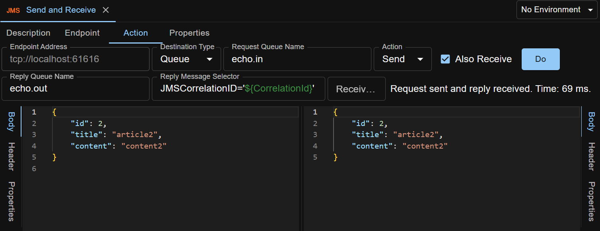

JMS request is used to operate on a JMS queue or topic, like sending messages to a queue.

Supported JMS providers: **ActiveMQ, Solace**.

Actions available: **Send (and optionally Also Receive), Browse Queue, Clear Queue, Check Queue Depth, Publish**.

## Endpoint Details
To operate on a JMS queue or topic, some endpoint parameters are needed.

## Send Action
Send action is used to send a JMS message into a queue.

You can do one-way/fire-and-forget style invocation, i.e. send message to queue and done.

    <iframe width="560" height="315" src="https://www.youtube.com/embed/EZzxLVzw-vo?si=GUVb6urvdscrGHxU" title="YouTube video player" frameborder="0" allow="accelerometer; autoplay; clipboard-write; encrypted-media; gyroscope; picture-in-picture; web-share" referrerpolicy="strict-origin-when-cross-origin" allowfullscreen></iframe>

You can also do request-reply style invocation, i.e. send message to request queue and receive another message from reply queue. For example:

    <iframe width="560" height="315" src="https://www.youtube.com/embed/n_aMtRdIMr4?si=uMpDZl1hQjm4O_nX" title="YouTube video player" frameborder="0" allow="accelerometer; autoplay; clipboard-write; encrypted-media; gyroscope; picture-in-picture; web-share" referrerpolicy="strict-origin-when-cross-origin" allowfullscreen></iframe>

Message body can be XML, JSON, or any other text format.

Click `Do` button to Send the message and receive the reply.

## Browse Action
Browse action is used to read a message from a queue without deleting the message.

You can browse the queue by message index or by a substring (in message body).
 

Click `Do` button to read the message.
