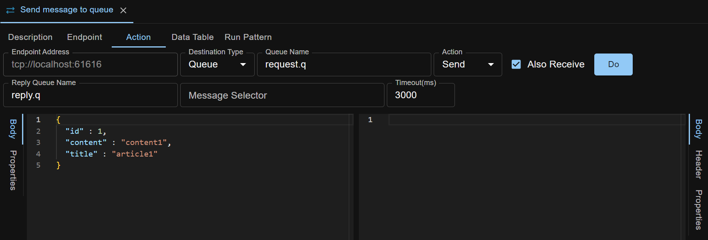
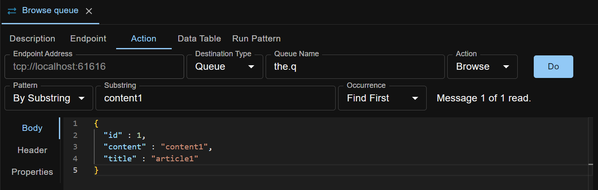

JMS test step is normally used in combination with other test steps to create automated test cases. However, you can also use it to manually operate on a JMS queue or topic, like sending messages to a queue.

Supported JMS providers: **ActiveMQ, Solace**.

Actions available in the JMS test step: **Send (and optionally Also Receive), Browse Queue, Publish, Clear Queue, Check Queue Depth**.

## Endpoint Details
To operate on a JMS queue or topic, some endpoint parameters are needed for API Test Base to connect to the queue manager.

## Send Action
Send action is used to send a JMS message into a queue.

You can do one-way/fire-and-forget style invocation, i.e. send message to queue and done.

You can also do request-reply style invocation, i.e. send message to request queue and receive another message from reply queue. For example:

Message body can be XML, JSON, or any other text format.

Click `Do` button to Send the message and receive the reply.

## Browse Action
Browse action is used to read a message from a queue without deleting the message.

You can browse the queue by message index or by a substring (in message body).
 

Click `Do` button to read the message.
