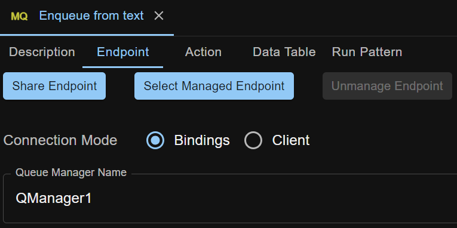
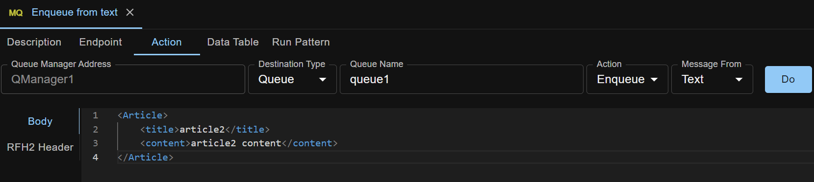
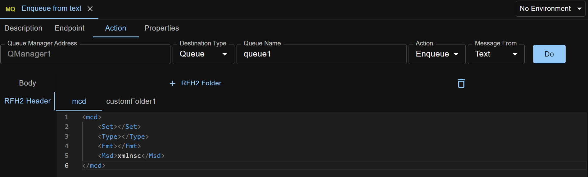
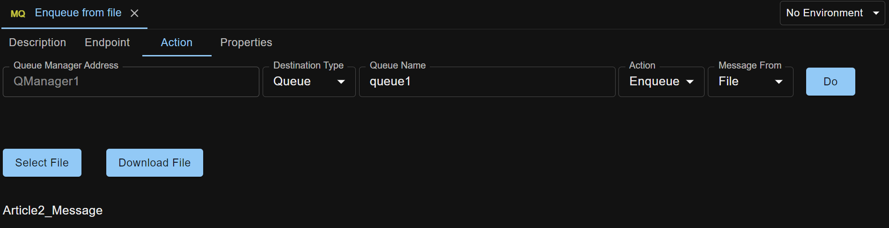
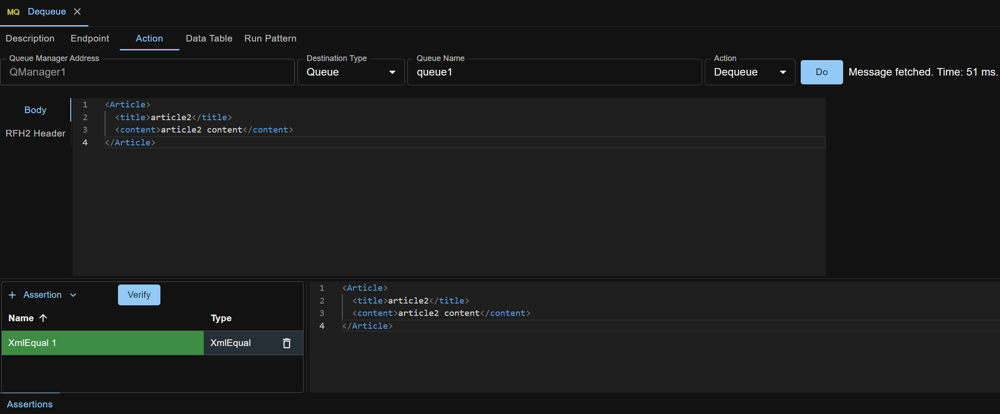
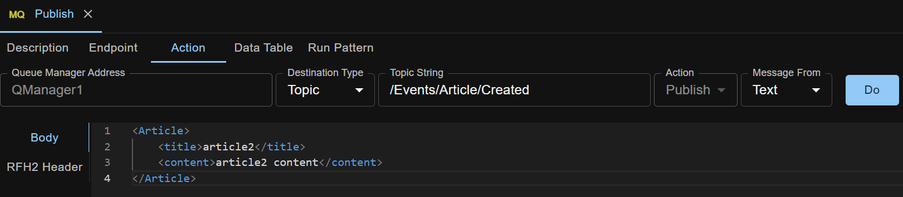

MQ request is used to operate on an IBM MQ queue or topic.

An MQ request can be used for ad hoc queue operations, replacing tools like RFHUtil or MQ Explorer, or in a test case to enqueue a message that triggers the API under test, to dequeue the API's output message for verification, or both — see [Test APIs triggered by queue messages and file drops](/#test-apis-triggered-by-queue-messages-and-file-drops).

To use MQ requests, set up the IBM MQ client jar first, as described in [Interact with Other Systems](/docs/en/interact-with-other-systems#ibm-mq).

Actions available: **Enqueue, Dequeue, Publish, Clear Queue, Check Queue Depth**.

## Endpoint Details
To operate on an IBM MQ queue or topic, some endpoint parameters are needed for API Test Base to connect to the queue manager.

## Enqueue Action
Enqueue action is used to `PUT` a message into a queue. You can provide the message in two ways.

### Provide Message by Entering Text

Text can be XML, JSON, or any other text format.

Click the `Do` button to PUT the message into the queue.

You can also include an **MQRFH2 header**, with one or more MQRFH2 folders, in the message, like below. Notice that each RFH2 folder must be a valid XML document.

    <mcd>                                //  an MQ defined/reserved RFH2 folder
        <Set></Set>
        <Type></Type>
        <Fmt></Fmt>
        <Msd>xmlnsc</Msd>
    </mcd>

    <customFolder1>                      //  a custom RFH2 folder
        <field1>value1</field1>
        <field2>value2</field2>
    </customFolder1>

### Provide Message by Uploading a File

This enables you to PUT a message of any format, whether binary or text.

The message in the file can contain an MQMD header, which will be recognized. If there is no MQMD header, one will be generated.

Again, click the `Do` button to PUT the message into the queue.

## Dequeue Action
Dequeue action is used to `GET` a message from a queue. When the Dequeue action is used in a test step, you can create assertions against the returned message body as well as the RFH2 header.

Click the `Do` button to get the message. Click the `Assertions` button to open the assertions panel and add/edit/verify assertions.

Currently the dequeued message body is assumed to be text.

## Publish Action
Publish action is used to publish a message onto a topic. As with the Enqueue action, you can provide the message in two ways. Here is the text way:

Click the `Do` button to publish the message onto the topic.