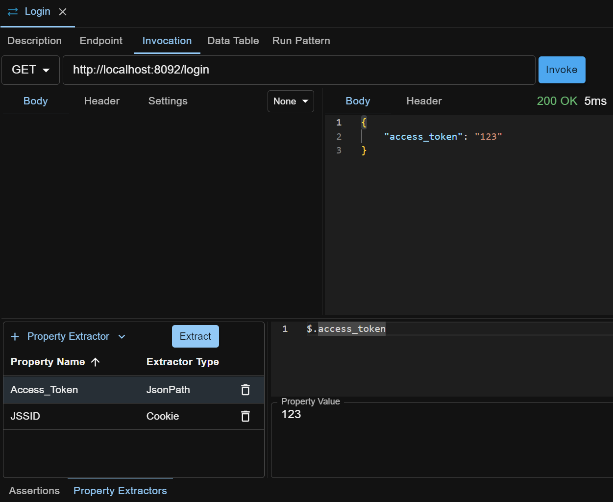
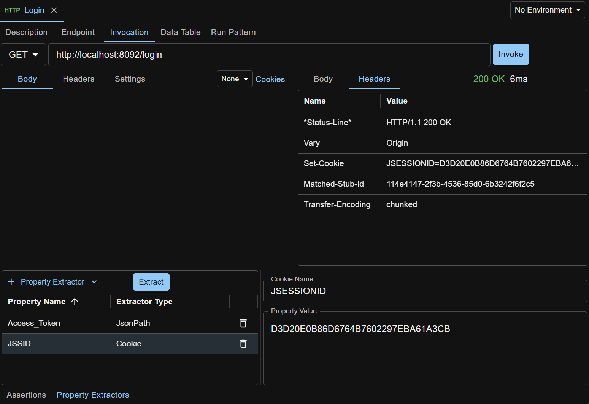

A property in API Test Base is a named String. A property can be used in any test case, test step, assertion or HTTP stub with syntax `${<Property_Name>}`, e.g. ${Output_Queue_Name}.

On running a test case or test step, the properties defined in them are resolved to String values.

Nested property, i.e. property inside property value, is supported. For example: define Prop1="Hello" and Prop2="${Prop1} World!", and Prop2's value will be "Hello World!".

## User Defined Properties
You can define custom properties on a test case through the Properties tab, then use them in the test steps and assertions inside the test case. You can double click the property value cell (after entering edit mode) in the grid to pop out a textarea to edit big string, especially one with line breaks.

A straightforward usage of user defined property is that it can be defined once and used multiple times in the test steps or assertions inside the test case.

Another usage is `pattern based test case creation`. If already familiar with a test pattern, you can define a test case as template to capture the test steps. You can then define properties on the template test case and reference them in the test steps. To create a new test case, copy corresponding test case template, tailor the test steps as appropriate (such as removing unnecessary steps), enter the property values and the new test case is ready to run. There is no need for you to dive into any test step to locate and enter those values. This treats the test case somewhat like a black box and properties like the arguments to the black box, hence increasing the speed of test case creation.

## Implicit Properties
These are properties dynamically created by API Test Base on running a test case or test step.

#### Test_Case_Start_Time
The timestamp when the test case run starts. Format is yyyy-mm-dd hh:mm:ss.fff, e.g. 1997-01-31 09:26:50.124.

#### Test_Step_Start_Time
The timestamp when the test step run starts. Format is same as Test_Case_Start_Time.

#### Test_Case_Individual_Start_Time
The timestamp when the test case individual run (like in data driven test case run) starts. Format is same as Test_Case_Start_Time.

#### Test_Step_Repeat_Run_Index
Index of repeat run when a test step is defined as a repeated test step and it is run in a test case. Starting from 1.

## Data Table
Properties can also come from a data table. Refer to [Data Driven Testing](/docs/en/data-driven-testing).

## Extracted Properties
Extract properties from API response in one test step, and use them in later test steps during test case run. This enables passing dynamic data between test steps.

Currently only HTTP test step has property extractors.

### JSONPath Property Extractor
Used to extract property from HTTP response body via JSON path.

### Cookie Property Extractor
Used to extract property from HTTP response Set-Cookie header by cookie name. 

