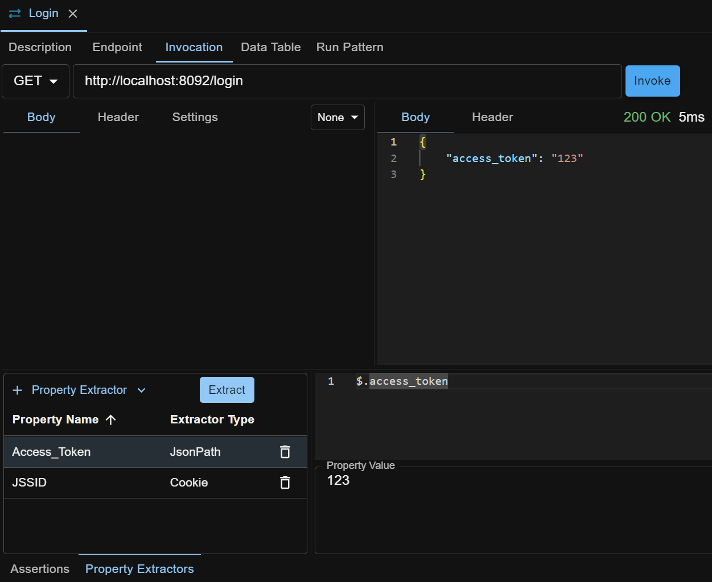
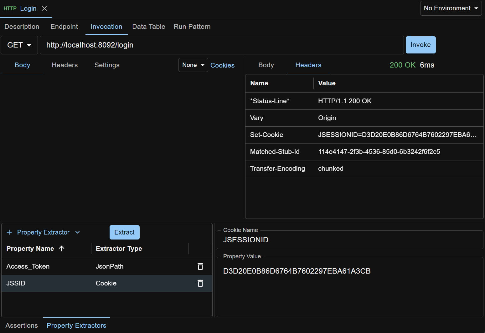

A property in API Test Base is a named String.

A property can be defined in various ways and scopes, and used in request, test case, test step, assertion or HTTP stub with syntax `${<Property_Name>}`, e.g. `${output.queue.name}`.

Properties come from several sources: defined by you, created implicitly by ATB, supplied by a data table, or extracted from an API response. The sections below cover each.

## User Defined Properties
You can define custom properties in a request, test case, folder, environment or workspace on the `Properties` tab, then use/reuse them across the request, test case, folder, environment or workspace.

Another usage is `template based test case creation`. If already familiar with a test pattern, you can create a test case as template to capture the test steps. Define properties on the template test case and use them in the test steps. To create a new test case, copy the test case template, tailor the test steps as appropriate (such as removing unnecessary steps), enter the property values and the new test case is ready to run. There is no need for you to dive into any test step to locate and enter those values. This treats the test case like a black box and properties like the parameters to the black box, hence making it easier to create a new test case.

## Scope and Precedence
The same property name can be defined at more than one scope. When it is, the innermost definition wins and overrides the outer ones. The override order, from highest to lowest priority, depends on where the property is referenced:

- From a request: `request` → `folder` → `environment` → `workspace`
- From a test step: `test step` → `test case` → `folder` → `environment` → `workspace`

A request is standalone — it is not part of a test case — so its chain has no test case scope.

Folders form a hierarchy: a property defined on a lower-level (nested) folder overrides one of the same name defined on a higher-level (ancestor) folder.

A value defined on an environment is effective only while that environment is selected, while a value defined on the workspace is effective across all environments. See [Environments Management](/docs/en/environments-management#scope-environment-and-workspace) for more on environment and workspace scope.

## Secrets
A secret is referenced with the same `${<Property_Name>}` syntax as a property, but its value is stored encrypted and kept out of the shared workspace. Secrets are defined on an environment only. See [Environments Management](/docs/en/environments-management#properties-and-secrets) for how to define and store them.

## Implicit Properties
These are properties dynamically created by ATB.

### atb.data.dir
The file system directory where all your test data and configurations are located. Refer to [Administration](/docs/en/administration) for more details.

### atb.http.port
The HTTP port number exposed by ATB for its REST APIs and UI. It can be configured as seen in [Administration](/docs/en/administration).

### auto.mock.server.http.port
The HTTP port number of the `Auto` mock server in the current workspace.

### manual.mock.server.http.port
The HTTP port number of the `Manual` mock server in the current workspace.

### test.case.start.time
The timestamp when the test case run starts. Format is yyyy-mm-dd hh:mm:ss.fff, e.g. 1997-01-31 09:26:50.124.

### test.step.start.time
The timestamp when the test step run starts. Format is same as `${test.case.start.time}`.

### test.case.individual.start.time
The timestamp when the test case individual run (like in data driven test case run) starts. Format is same as `${test.case.start.time}`.

### test.step.repeat.run.index
Index of repeat run when a test step is defined as a repeated test step and it is run in a test case. Starting from 1.

## Data Table
Properties can also come from a data table defined on a test case, where each row supplies a set of properties scoped to one individual run of the test case. Refer to [Data Driven Testing](/docs/en/data-driven-testing).

## Extracted Properties
Extract properties from API response in one test step, and use them in later test steps during test case run. This enables passing dynamic data between test steps.

Currently only HTTP test step has property extractors.

### JSONPath Property Extractor
Used for extracting property from HTTP response body via JSON path. For example:



### Cookie Property Extractor
Used for extracting property from HTTP response Set-Cookie header by cookie name. For example:



### XPath Property Extractor
Used for extracting property from HTTP response body via XPath. The response body can be XML or HTML.

When the response body is HTML, the XPath evaluation is powered by [JsoupXpath](https://github.com/zhegexiaohuozi/JsoupXpath).

Some tips on JsoupXpath:
- In absolute XPath, root node is `<html>`. For example, to select an element, you can use an absolute XPath like `/body/form`, but not `/html/body/form`.
- XML namespace is not applicable.

## Nested Properties
Nested property, i.e. property inside property value, is supported. For example:
```
prop1="Hello"
prop2="${prop1} World!"        // prop2's value is "Hello World!"
```

A property value can likewise contain a [Groovy expression](/docs/en/expressions), which is evaluated at run time.