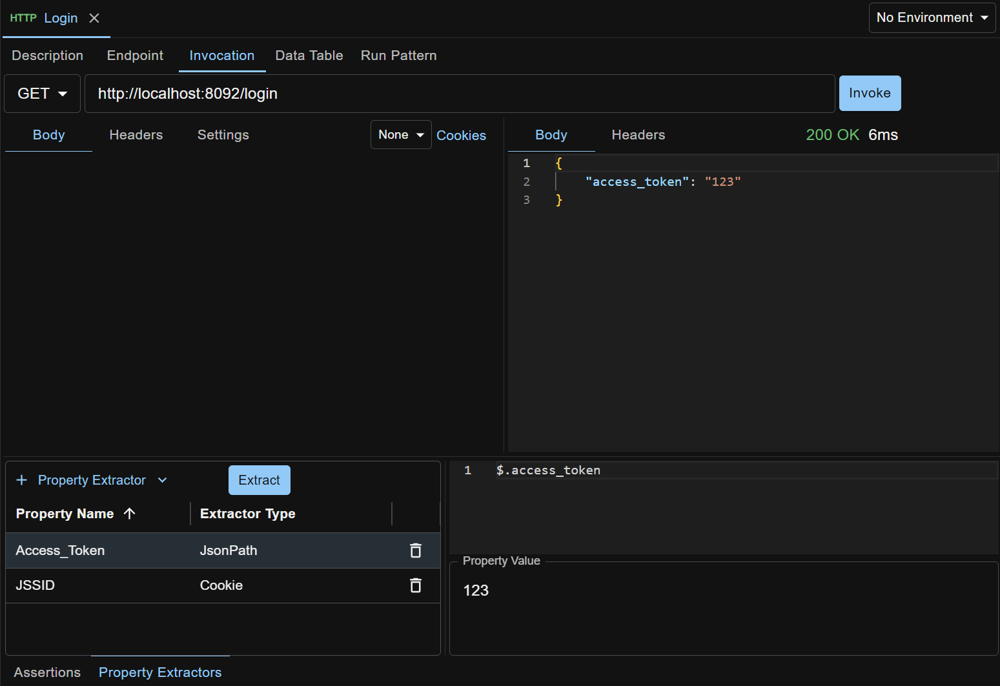

A property in API Test Base is a named String.

A property can be defined in various ways and scopes, and used in request, test case, test step, assertion or HTTP stub with syntax `${<Property_Name>}`, e.g. ${Output_Queue_Name}.

## User Defined Properties
You can define custom properties in a request or test case on the `Properties` tab, then use them in the request, test steps or assertions.

You can double click the property value cell (after entering edit mode) in the grid to pop out a textarea to edit big text, especially one with line breaks, like JSON or XML.

A straightforward usage of user defined property is that it can be defined once and used multiple times in the same request or test case.

Another usage is `pattern based test case creation`. If already familiar with a test pattern, you can define a test case as template to capture the test steps. You can then define properties on the template test case and reference them in the test steps. To create a new test case, copy corresponding test case template, tailor the test steps as appropriate (such as removing unnecessary steps), enter the property values and the new test case is ready to run. There is no need for you to dive into any test step to locate and enter those values. This treats the test case somewhat like a black box and properties like the arguments to the black box, hence increasing the speed of test case creation.

## Implicit Properties
These are properties dynamically created by API Test Base on running a test case or test step.

#### Test_Case_Start_Time
The timestamp when the test case run starts. Format is yyyy-mm-dd hh:mm:ss.fff, e.g. 1997-01-31 09:26:50.124.

#### Test_Step_Start_Time
The timestamp when the test step run starts. Format is same as Test_Case_Start_Time.

#### Test_Case_Individual_Start_Time
The timestamp when the test case individual run (like in data driven test case run) starts. Format is same as Test_Case_Start_Time.

#### Test_Step_Repeat_Run_Index
Index of repeat run when a test step is defined as a repeated test step and it is run in a test case. Starting from 1.

## Data Table
Properties can also come from a data table. Refer to [Data Driven Testing](/docs/en/data-driven-testing).

## Extracted Properties
Extract properties from API response in one test step, and use them in later test steps during test case run. This enables passing dynamic data between test steps.

Currently only HTTP test step has property extractors.

### JSONPath Property Extractor
Used for extracting property from HTTP response body via JSON path. For example:



### Cookie Property Extractor
Used for extracting property from HTTP response Set-Cookie header by cookie name. For example:


### XPath Property Extractor
Used for extracting property from HTTP response body via XPath. The response body can be XML or HTML.

When the response body is HTML, the XPath evaluation is powered by [JsoupXpath](https://github.com/zhegexiaohuozi/JsoupXpath).

Some tips on JsoupXpath:
- In absolute XPath, root node is `<html>`. For example, to select an element, you can use an absolute XPath like `/body/form`, but not `/html/body/form`.
- XML namespace is not applicable.

## Nested Properties
Nested property, i.e. property inside property value, is supported. For example:
```
Prop1="Hello"
Prop2="${Prop1} World!"        // Prop2's value is "Hello World!"
```