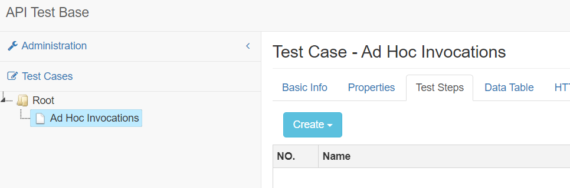

## Install and Launch





Download installer `apitestbase-{{ site.atb_release_version }}.exe` from the [latest release page](https://github.com/apitestbase/apitestbase-release/releases/tag/{{ site.atb_release_version }}).

Double click the installer and follow through the normal Windows application installation process.

Once the installation finishes, you can launch API Test Base from Start Menu or Desktop shortcut.

First time launching, a Windows Defender Firewall alert will pop up. Check the `Private networks ...` option, uncheck the `Public networks ...` option, and click the `Allow access` button.





Download `apitestbase-{{ site.atb_release_version }}.dmg` from the [latest release page](https://github.com/apitestbase/apitestbase-release/releases/tag/{{ site.atb_release_version }}).

Double click the dmg and copy `API Test Base.app` to your /Applications folder.

Open the `/Applications/API Test Base.app`, and you'll see a dialog stating '"API Test Base.app" can't be opened because Apple cannot check it for malicious software'. This is because the app hasn't been signed using Apple certificate (which is not free).

Click OK on the dialog, open System Settings, go to Privacy & Security, and you'll see a warning message 'API Test Base.app was blocked from use because it is not from an identified developer'.

Click the Open Anyway button. If prompted for login password (for approving the app opening), enter the password, and you'll see the first dialog again, but with an Open button.

Click the Open button to launch API Test Base.

After successful launch, you'll no longer see the dialogs when launching again.





Once the application is launched, a system tray icon shows. Click the icon to bring up the menu, like below.

Select `Open ATB` to open API Test Base UI in your default browser.

## Ad Hoc Invocation
If you only want to invoke an API and see its response, just need to create a test step in a test case.

Right click on a folder in the tree, select Create Test Case and give it a name.

Suppose you want to invoke a REST API. On the right pane of the screen, under the Test Steps tab, click the `Create` dropdown button and select `HTTP Step`. The test step edit view opens.

Under the Basic Info tab, enter the test step name. Under the Invocation tab, select Method like `GET`, enter a URL like `http://localhost:8090/api/articles` (an API Test Base bundled API) and click the `Invoke` button.

