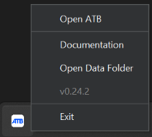
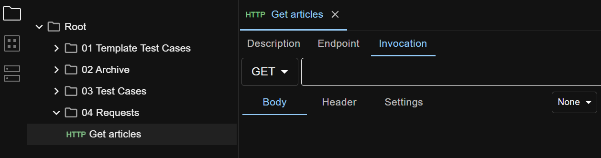
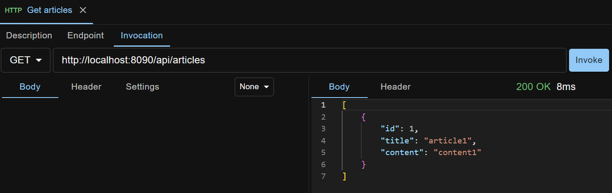

## Install and Launch





Download installer `apitestbase-{{ site.atb_release_version }}.exe` from the [latest release page](https://github.com/apitestbase/apitestbase-release/releases/tag/{{ site.atb_release_version }}){:target="_blank"}.

Double click the installer and follow through the normal Windows application installation process. You will likely get a warning dialog from Windows Defender SmartScreen, because the app hasn't been digitally signed by a Microsoft trusted Certificate Authority (which is expensive!). Click 'More info' on the dialog, and click 'Run anyway' to proceed installing API Test Base.

Once the installation finishes, you can launch API Test Base from Start Menu or Desktop shortcut.

First time launching, a Windows Defender Firewall alert will pop up. Check the `Private networks ...` option, uncheck the `Public networks ...` option, and click the `Allow access` button.

Once the application is launched, a system tray icon shows. Click the icon to bring up the menu, like below.



Select `Open ATB` to open API Test Base UI in your default browser.





Download `apitestbase-{{ site.atb_release_version }}.dmg` from the [latest release page](https://github.com/apitestbase/apitestbase-release/releases/tag/{{ site.atb_release_version }}){:target="_blank"}.

Double click the dmg and drag `API Test Base.app` to your /Applications folder.

Open the `/Applications/API Test Base.app` to launch API Test Base. A system tray icon shows. Click the icon to bring up the menu, like below.


Select `Open ATB` to open API Test Base UI in your default browser.





If you are using Docker Engine (Linux only) or Docker Desktop version 4.34 or later, the recommended way to launch API Test Base is with [host networking](https://docs.docker.com/engine/network/drivers/host/){:target="_blank"}.

```
docker run -d -t -v /data/folder/on/host:/atb/data --name apitestbase-{{ site.atb_release_version }} --net=host apitestbase/apitestbase:{{ site.atb_release_version }}
```

Notice: Replace `/data/folder/on/host` with your own value, so that your data can be retained on the host machine when the container is deleted. For example (Windows host):

```
docker run -d -t -v C:\Users\zheng\AppData\Roaming\ApiTestBaseDocker:/atb/data --name apitestbase-{{ site.atb_release_version }} --net=host apitestbase/apitestbase:{{ site.atb_release_version }}
```

If not using host networking
```
// Windows or Mac OS host
docker run -d -t -v /data/folder/on/host:/atb/data --name apitestbase-{{ site.atb_release_version }} -p 8090:8090 apitestbase/apitestbase:{{ site.atb_release_version }}

// Linux host
docker run -d -t -v /data/folder/on/host:/atb/data --add-host=host.docker.internal:host-gateway --name apitestbase-{{ site.atb_release_version }} -p 8090:8090 apitestbase/apitestbase:{{ site.atb_release_version }}
```

Once the container is running, open `http://localhost:8090/ui` in a Chrome browser on the host machine.





## Ad Hoc Invocation
Suppose you want to invoke a REST API.

Right click anywhere in the left side pane, select `New Request` > HTTP, give it a name and press Enter. The request is created:



In the request edit view, under the Invocation tab, select Method `GET`, enter a URL like `http://localhost:8090/api/articles` (an API Test Base bundled API) and click the `Invoke` button.



The request, as well as all the data you create in API Test Base, is automatically persisted (no Save button), so no need to worry about data loss across browser or machine restarts.

Docker users: if not using host networking, to enable ATB docker container to call your API on the host machine, use `host.docker.internal` as hostname in the request URL.