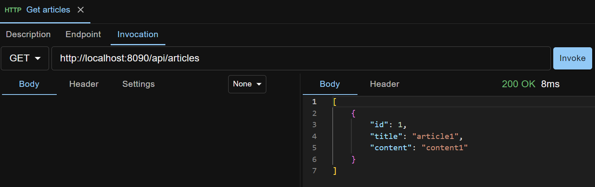

## Install and Launch





Download API Test Base `{{ site.atb_release_version }}` from the [release page](https://github.com/apitestbase/apitestbase-release/releases/tag/{{ site.atb_release_version }}){:target="_blank"}.

Double click the dmg and drag `API Test Base.app` to your `/Applications` folder.

Then open it from Launchpad or the Applications folder.





Download API Test Base `{{ site.atb_release_version }}` from the [release page](https://github.com/apitestbase/apitestbase-release/releases/tag/{{ site.atb_release_version }}){:target="_blank"}.

The Windows release comes in two forms: a setup installer and a portable zip. Pick the one you prefer.

The setup installer walks you through installation; leave the `Run API Test Base` checkbox ticked on its final wizard screen, so ATB starts when you click `Finish`. The portable needs no installation — extract the zip and run `API Test Base.exe` in the extracted folder to launch ATB.

In either case, the first time you run it Microsoft Defender SmartScreen will likely warn you, because the app hasn't been digitally signed by a Microsoft trusted Certificate Authority (which is expensive!). Click `More info` on the dialog, and click `Run anyway` to proceed. A Windows Defender Firewall alert also pops up on first launch — check the `Private networks ...` option, uncheck the `Public networks ...` option, and click the `Allow access` button.





If you are using Docker Engine (Linux only) or Docker Desktop version 4.34 or later, the recommended way to launch API Test Base is with [host networking](https://docs.docker.com/engine/network/drivers/host/){:target="_blank"}.

```
docker run -d -t -v /data/folder/on/host:/atb/data --name apitestbase-{{ site.atb_release_version }} --net=host apitestbase/apitestbase:{{ site.atb_release_version }}
```

Notice: Replace `/data/folder/on/host` with your own value, so that your data can be retained on the host machine when the container is deleted. For example (Windows host):

```
docker run -d -t -v C:\Users\zheng\AppData\Roaming\ApiTestBaseDocker:/atb/data --name apitestbase-{{ site.atb_release_version }} --net=host apitestbase/apitestbase:{{ site.atb_release_version }}
```

If not using host networking
```
// Windows or macOS host
docker run -d -t -v /data/folder/on/host:/atb/data --name apitestbase-{{ site.atb_release_version }} -p 127.0.0.1:8090:8090 apitestbase/apitestbase:{{ site.atb_release_version }}

// Linux host
docker run -d -t -v /data/folder/on/host:/atb/data --add-host=host.docker.internal:host-gateway --name apitestbase-{{ site.atb_release_version }} -p 127.0.0.1:8090:8090 apitestbase/apitestbase:{{ site.atb_release_version }}
```

Once the container is running, open `http://localhost:8090/ui` in a web browser on the host machine.

If you use the docker container in `CI/CD` pipeline, call ATB's own API (with HTTP command line tool like `curl`) for API test automation. Open `http://localhost:8090/apidoc` on host machine for checking the Swagger UI. For a full walkthrough, see [Integration Unit Testing Automation in CI/CD Pipeline](/docs/en/integration-unit-testing-automation-in-cicd-pipeline).





Download `apitestbase-{{ site.atb_release_version }}-allos-nojre.zip` from the [release page](https://github.com/apitestbase/apitestbase-release/releases/tag/{{ site.atb_release_version }}){:target="_blank"}.

This build is for running ATB on any OS where `Java 21+` has been installed. To run the ATB, extract the downloaded zip, and run the `start.bat` (on Windows) or `start.sh` (on macOS or Linux).

It is typically used in `CI/CD` pipeline where you call ATB's own API (with HTTP command line tool like `curl`) for API test automation. Open `http://localhost:8090/apidoc` for checking the Swagger UI. For a full walkthrough, see [Integration Unit Testing Automation in CI/CD Pipeline](/docs/en/integration-unit-testing-automation-in-cicd-pipeline).

You can also use it (on page `http://localhost:8090/ui`) for requests or test cases creation, but it opens a terminal window which might not be the best UX.





## Ad Hoc Invocation
With ATB running, let's send a quick ad hoc request to get familiar with the UI.

Right click anywhere on the left side pane, select `New Request` > `HTTP`, give it a name and press Enter. The request is created.

In the request edit view, under the `Invocation` tab, enter a URL like `http://localhost:8090/api/articles` (an API Test Base bundled API) and click the `Invoke` button.



The request, as well as all the data you create in API Test Base, is automatically persisted on your local machine. No Save button.

`Docker users`: if not using host networking, to enable ATB docker container to call your API on the host machine, use `host.docker.internal` as hostname in the request URL.

## Next Steps
You've run an ad hoc request. Next, build a structured test case that invokes an API and verifies its side effect — see [Creating an Automated Test Case](/docs/en/creating-an-automated-test-case).