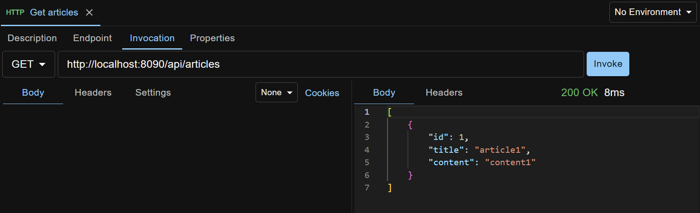

## Install and Launch





Download API Test Base `{{ site.atb_release_version }}` from the [release page](https://github.com/apitestbase/apitestbase-release/releases/tag/{{ site.atb_release_version }}){:target="_blank"}.

When running the setup or portable binary, you will likely get a warning dialog from Microsoft Defender SmartScreen, because the app hasn't been digitally signed by a Microsoft trusted Certificate Authority (which is expensive!). Click `More info` on the dialog, and click `Run anyway` to proceed.

First time launching, a Windows Defender Firewall alert will pop up. Check the `Private networks ...` option, uncheck the `Public networks ...` option, and click the `Allow access` button.





Download API Test Base `{{ site.atb_release_version }}` from the [release page](https://github.com/apitestbase/apitestbase-release/releases/tag/{{ site.atb_release_version }}){:target="_blank"}.

Double click the dmg and drag `API Test Base.app` to your `/Applications` folder.





If you are using Docker Engine (Linux only) or Docker Desktop version 4.34 or later, the recommended way to launch API Test Base is with [host networking](https://docs.docker.com/engine/network/drivers/host/){:target="_blank"}.

```
docker run -d -t -v /data/folder/on/host:/atb/data --name apitestbase-{{ site.atb_release_version }} --net=host apitestbase/apitestbase:{{ site.atb_release_version }}
```

Notice: Replace `/data/folder/on/host` with your own value, so that your data can be retained on the host machine when the container is deleted. For example (Windows host):

```
docker run -d -t -v C:\Users\zheng\AppData\Roaming\ApiTestBaseDocker:/atb/data --name apitestbase-{{ site.atb_release_version }} --net=host apitestbase/apitestbase:{{ site.atb_release_version }}
```

If not using host networking
```
// Windows or macOS host
docker run -d -t -v /data/folder/on/host:/atb/data --name apitestbase-{{ site.atb_release_version }} -p 8090:8090 apitestbase/apitestbase:{{ site.atb_release_version }}

// Linux host
docker run -d -t -v /data/folder/on/host:/atb/data --add-host=host.docker.internal:host-gateway --name apitestbase-{{ site.atb_release_version }} -p 8090:8090 apitestbase/apitestbase:{{ site.atb_release_version }}
```

Once the container is running, open `http://localhost:8090/ui` in a Chrome browser on the host machine.





## Ad Hoc Invocation
Suppose you want to invoke a REST API.

Right click anywhere on the left side pane, select `New Request` > HTTP, give it a name and press Enter.

The request is created:


In the request edit view, under the Invocation tab, select Method `GET`, enter a URL like `http://localhost:8090/api/articles` (an API Test Base bundled API) and click the `Invoke` button.



The request, as well as all the data you create in API Test Base, is automatically persisted (no Save button), so no need to worry about data loss across app or machine restarts.

`Docker users`: if not using host networking, to enable ATB docker container to call your API on the host machine, use `host.docker.internal` as hostname in the request URL.